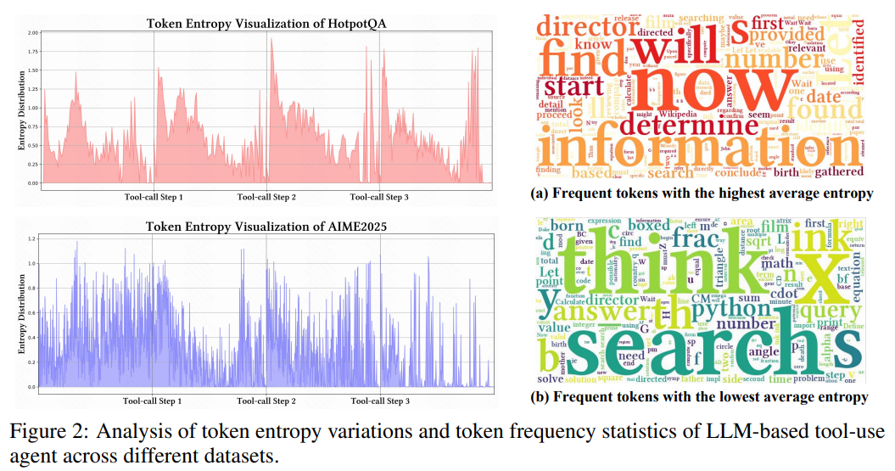

    AGENTIC REINFORCED POLICY OPTIMIZATION：ARPO: 让Agent在关键时刻多探索一步！

1、agent开发时，tools的调用是必不可少的。但是在tools调用后会产生一个有趣的现象：tools调用后的结果和上文一起作为输入给model后，接下来10~50个token的entropy会明显升高，说明此时的model会陷入迷茫：token的distribution都很接近，那么next token该生成什么了？

* 先说一下我个人猜测的原因：各大厂商在pre-train、post-train model的时候，大概率使用的都是爬取或人工校验的数据，这些**数据都是用户在使用各种互联网服务时产生的，肯定是不包括agent tools调用相关信息的，所以model在训练时是没遇到过agent tools调用后结果信息的**，自然不知道怎么应对了

2、既然entropy高、model也不知道该往哪个方向走，**为了不错过正确的岔口，那就提升sampling数量、尽可能多走几条路径**？遇到这种**很多分支的岔路口，为了找到最好的分支，只能多尝试咯**，除此以外还有更好的办法么？

```
			# ==== Entropy-based Adaptive Beaming ====
                          
                            entropy_now = current_entropy_dict.get(source_idx, 0.0)
                            entropy_init = self.initial_entropy_dict.get(source_idx, 0.0)
                            entropy_delta = entropy_now - entropy_init
                            prob = random.random() - self.entropy_weight * entropy_delta
                  
                            prob = max(0.0, min(1.0, prob))
                            if prob > self.branch_probability: 
                                continue
```

3、model在rollout了多个岔路口后，得到了多个trajectory，这么多的trajectory，哪条是最好的？都到这一步了，**肯定要选择好的trajectory，给予high reward，让model多学些这些好的trajectory，下次再遇到类似state就没必要再exploration了，直接选择这次已经确定的high reward的trajectory即可**！

* 这么多的trajectory，哪条是最好的了？这不就是今年初GRPO的主要功能么：通过reward function找到最好的trajectory，然后用ratio的方式提升model生成好trajectory的概率！

4、论文原文：https://arxiv.org/pdf/2507.19849     代码： https://github.com/dongguanting/ARPO

* high entropy和low entropy对应的token对比：
  * high entropy后的next token的可能性多样，比如“now，we will find/provide/determine ......”等后面能接很多事物, 属于**引导式、召唤式词汇**，表示模型处在决策或行动转换点，典型的**策略选择、转换结点**；
  * low entropy后的next token可能性较少，比较确定，**更多是内部连贯产生的推理内容**；


