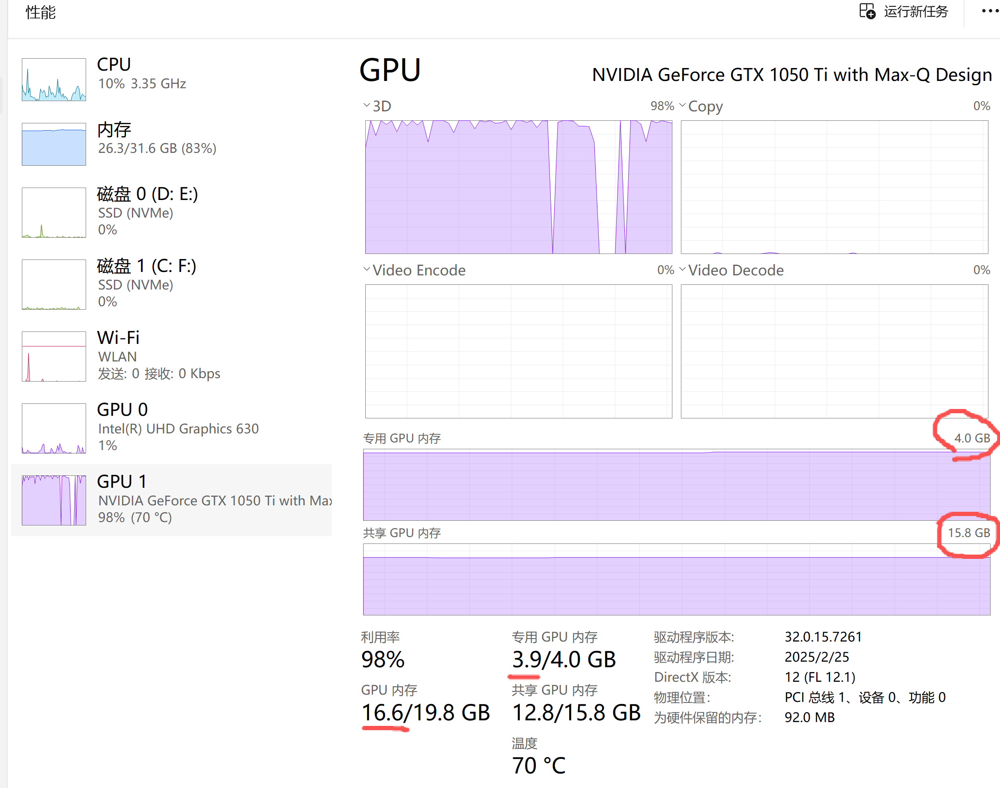

| Round | Current Landscape                                   | Main Module (B₁) – The Strong One                   | Auxiliary Module (B₂) – The Troublemaker                                                                                         | Where the rope (parameters) ends up                                                                            |
| ----- | --------------------------------------------------- | ----------------------------------------------------- | ---------------------------------------------------------------------------------------------------------------------------------- | -------------------------------------------------------------------------------------------------------------- |
| 1     | Still on a steep, sharp slope (sharp minima region) | Pulls with full strength toward the valley bottom     | The little guy also pulls back desperately                                                                                         | Main module is much stronger → parameters move significantly downward                                         |
| 2     | Already near a very sharp & deep narrow valley      | Super excited, keeps pulling downward                 | Discovers: “With just a tiny pull in the worst direction, loss explodes!” → uses full ρ strength to yank upward                | Main module realizes: “If I go any lower, this troublemaker can make loss skyrocket!” → dares not go deeper |
| 3     | Main module starts probing left and right           | Tries a step left → safe; tries a step right → safe | Troublemaker tries every possible direction within ρ radius, but can’t increase loss much anymore (the basin is flat everywhere) | Neither can overpower to move the other → equilibrium reached!                                                |

### What actually happens in Bi-LoRA?

This tug-of-war is exactly the training dynamics of **Bi-LoRA**:

- **Main module (B₁)**: the “good student” that always tries to **minimize** average loss (normal training direction).
- **Auxiliary module (B₂)**: the “adversary” that is allowed to add a **bounded perturbation** (||B₂A₂|| ≤ ρ) and tries to **maximize** loss — it keeps looking for the most fragile/vulnerable direction.
- Because the main module is much stronger, the parameters still move toward lower average loss in the end.
- However, whenever the main module tries to sneak into a **sharp, narrow valley** (low average loss but extremely sensitive), the auxiliary module immediately finds a tiny push that sends loss soaring. This scares the main module away from sharp regions.
- The only place where both sides become powerless is the center of a **wide, flat basin**: low loss + flat everywhere within radius ρ.

**Training converges precisely when**:

> “The auxiliary module has tried its hardest (within the allowed perturbation budget ρ) but can no longer significantly increase the loss, and the main module cannot find any lower point without being dragged up a cliff by the adversary.”

This equilibrium point is called a **flat minimum** or **robust local minimum** — exactly what we want for better generalization and robustness.

### Purpose of Bi-LoRA in one sentence

By letting a “malicious but weak” auxiliary LoRA constantly attack the model during training, Bi-LoRA forces the optimizer to automatically discover **low-loss regions that are inherently wide and flat**, instead of falling into sharp, brittle minima that overfit or break under tiny perturbations.

In short: **Train with a built-in enemy → end up with a naturally robust and generalizable model.**

train on my laptop:

