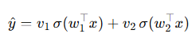

1、《Provable Scaling Laws of Feature Emergence from Learning Dynamics of Grokking》

by https://www.yuandong-tian.com/

code: https://github.com/facebookresearch/luckmatters/tree/yuandong3/grokking

* Stage I: Lazy Learning —— 隐藏层几乎不动，顶层过拟合随机表示，表现为记忆
  * `W1_delta_norm` 极小（<1e-3），说明隐藏层冻结
* Stage II: Independent Feature Learning —— 由于 weight decay，反向梯度 G_F携带标签结构，每个隐藏单元独立地沿某个能量函数 E 的梯度上升，收敛到局部极大值（即涌现特征）
  * 准确率尚未饱和（<95%）
  * `grad_cosine_sim` 高（>0.6），表明各神经元梯度方向一致（独立沿同一能量函数上升）
  * `W1_norm` 显著增长（特征被激活）
* Stage III: Interactive Feature Learning —— 隐藏单元开始相互作用，G_F聚焦于尚未学会的缺失特征，完成泛化
  * 准确率已高（≥95%）
  * 但 `grad_norm` 仍显著（>0.1），说明仍在微调协作

| 阶段 | 名称                         | 核心行为                                                                                                                          | 可观测指标                                                                             |
| ---- | ---------------------------- | --------------------------------------------------------------------------------------------------------------------------------- | -------------------------------------------------------------------------------------- |
| I    | Lazy Learning                | 顶层过拟合随机隐藏表示，模型表现为记忆                                                                                            | `ΔW1_norm ≈ 0`（相邻 epoch 隐藏层权重几乎不变）                                    |
| II   | Independent Feature Learning | 因 weight decay，反向梯度$G_F$ 携带标签结构，<br />每个隐藏单元独立沿能量函数 $ E$ 的梯度上升，收敛到局部极大值（即涌现特征） | `grad_cosine_sim` 高（各神经元梯度方向一致）`weight_norm` 缓慢上升（特征被激活）   |
| III  | Interactive Feature Learning | 隐藏单元开始协作，$G_F$ 聚焦于尚未学会的缺失特征，完成泛化                                                                      | `train_loss ≈ 0` 但 `grad_norm` 出现新峰值 `feature_diversity` 高（学到多种基） |

2、model架构：模仿transformer架构，有embedding和mlp

```
class ModularNet(nn.Module):
    def __init__(self, m=97, hidden_dim=128):
        super().__init__()
        # 模仿 transformers 的 embedding 层
        self.embed = nn.Embedding(m, hidden_dim)
        self.fc1 = nn.Linear(hidden_dim * 2, hidden_dim)
        self.relu = nn.ReLU()
        self.fc2 = nn.Linear(hidden_dim, m)

    def forward(self, x):
        a = x[:,0]
        b = x[:,1]
        ea = self.embed(a) # shape: (batch_size, hidden_dim), 每个输入数字转成hidden_dim
        eb = self.embed(b)
        h = torch.cat([ea, eb], dim=1)
        h2 = self.relu(self.fc1(h))
        out = self.fc2(h2)
        return out
```

loss函数：

```
model = ModularNet(m=m, hidden_dim=hidden_dim).to(device)
    optimizer = optim.Adam(model.parameters(), lr=lr, weight_decay=weight_decay)
    criterion = nn.CrossEntropyLoss()

for x, y in loader:
        x = x.to(device)
        y = y.to(device)
        optimizer.zero_grad()
        logits = model(x) #logits.shape：(batch_size, m)，这里比如logits.shape=(128, 97)
        loss = criterion(logits, y)
        loss.backward()
        optimizer.step()
        total += x.size(0)
        total_loss += loss.item() * x.size(0)
        pred = logits.argmax(dim=1)
        correct += (pred == y).sum().item()
```

3、部分运行结果出现grokking：


4、部分结果解读：

| Epoch    | 阶段判断               | 依据                                                                                                                                                               |
| -------- | ---------------------- | ------------------------------------------------------------------------------------------------------------------------------------------------------------------ |
| 1        | Stage I: Lazy          | `train_acc ≈ 0`，但 `w_norm=6.5` 已不小 → 可能 Lazy 阶段极短（因使用 Embedding + ReLU，初始化已有结构）                                                      |
| 100      | Stage II → III 过渡   | `train_acc=1.0`（记忆完成），`test_acc=0.49` → 开始泛化；`w_norm` 快速上升（特征激活）；`Δw_norm` 较大（持续学习）                                       |
| 300–400 | Stage III: Interactive | `test_acc` 从 0.58 → 0.99（**grokking 发生！**）；`w_norm` 开始下降（weight decay 压缩冗余特征）；`grad_cos_sim` 从负变正并上升（梯度从随机 → 协同） |
| 500+     | 收敛                   | `test_acc=1.0`，`w_norm` 稳定在 ~27，`Δw_norm` 仍较大（因 weight decay 与梯度平衡）<br />feather_div缓慢下降，表明模型在 **剔除冗余、聚焦关键特征**   |

5、emergence example：

---

Suppose we have an input (x \in \mathbb{R}^d) and a target label (y). The network has one hidden layer with two neurons whose weights are (w_1, w_2), and the output layer has weights (v_1, v_2). The model’s prediction is:



We train using gradient descent plus weight decay.

* **Phase I (Lazy / Memorization Phase):**

  The **hidden weights (w_1, w_2) barely change**. The ***output weights (v_1, v_2) get trained so as to fit the training set***. The g**radients propagated back from the output layer to the hidden weights (w) are mostly noise**, with little structural signal. So **(w_1, w_2) stay roughly at their initial values**. In effect, the ***model “memorizes” the training set via the output layer*** on top of near-random hidden features.
* As training continues, the output weights (v) converge toward some combination. **Because of weight decay, (v) cannot become arbitrarily large** and must balance fitting accuracy vs regularization. This ***constraint causes the updates of (v) to start inducing a mild structured signal in the backpropagated gradient to (w)***. In particular, the ***gradient component on each (w_j) is no longer purely noise***; it begins to carry correlation with (y). At this point, ***(w_1) and (w_2) each receive a signal that can help them improve their predictive alignment with the label (y).***
* **Phase II (Independent Feature Learning):**

  Each (w_j) separately “climbs” along the gradient direction of an energy function (E(w_j)), meaning that ***each hidden neuron independently learns a feature that is useful relative to the label (y)***. This process can be slow; only after sufficient training will these features become clear and meaningful.
* **Phase III (Interactive Feature Learning):**

  Once (w_1) and (w_2) each have “signal directions,” interactions between them may emerge. If the **two hidden weights are too similar, the feedback mechanism might push them to diverge to avoid redundancy**. The mechanism (via backpropagation) begins **focusing more on those parts of the structure *not yet captured by either neuron*,  guiding *further learning of missing features***. Eventually,  ***when the missing regularities are filled in, the output and hidden layers work synergistically***  , and the model’s generalization performance suddenly improves. That is the “grokking” moment.

In this toy scenario, the *delay* in grokking arises because, ***initially, the hidden layer almost never learns useful features***. Only when the **output layer and weight decay jointly cause the backpropagated gradient** to  ***carry informative signal does the hidden layer gradually learn general-purpose features; once these features are sufficiently integrated, the model “suddenly” generalizes.* **
