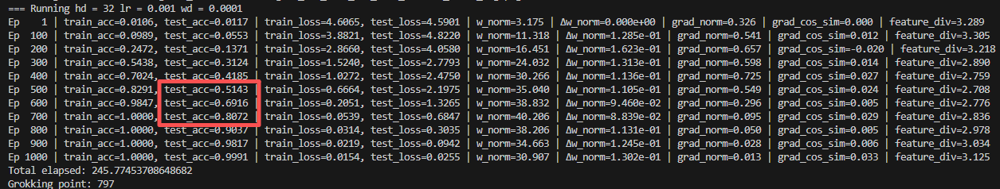
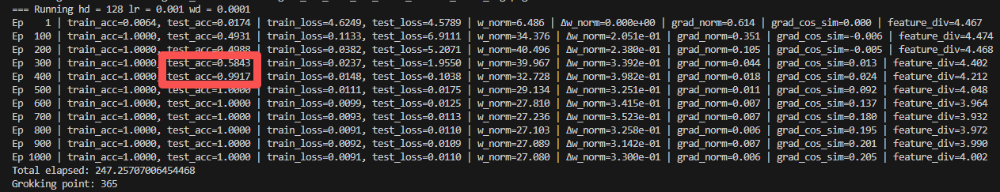
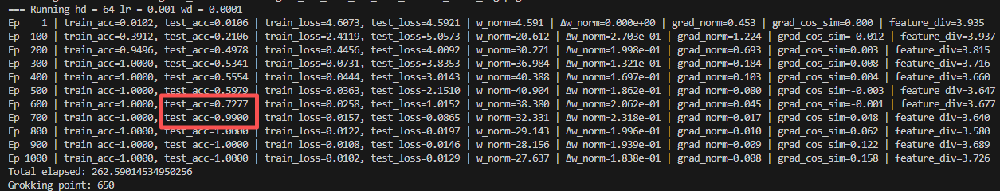
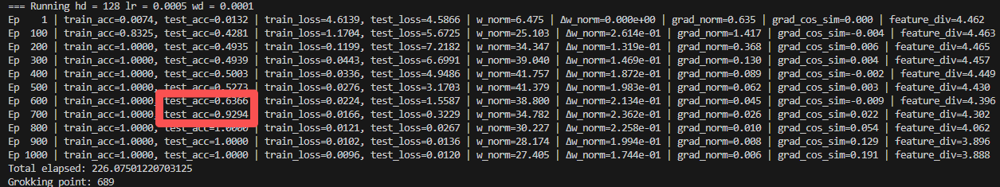

1、《Provable Scaling Laws of Feature Emergence from Learning Dynamics of Grokking》

by https://www.yuandong-tian.com/

code: https://github.com/facebookresearch/luckmatters/tree/yuandong3/grokking

* Stage I: Lazy Learning —— 隐藏层几乎不动，顶层过拟合随机表示，表现为记忆
  * `W1_delta_norm` 极小（<1e-3），说明隐藏层冻结
* Stage II: Independent Feature Learning —— 由于 weight decay，反向梯度 G_F携带标签结构，每个隐藏单元独立地沿某个能量函数 E 的梯度上升，收敛到局部极大值（即涌现特征）
  * 准确率尚未饱和（<95%）
  * `grad_cosine_sim` 高（>0.6），表明各神经元梯度方向一致（独立沿同一能量函数上升）
  * `W1_norm` 显著增长（特征被激活）
* Stage III: Interactive Feature Learning —— 隐藏单元开始相互作用，G_F聚焦于尚未学会的缺失特征，完成泛化
  * 准确率已高（≥95%）
  * 但 `grad_norm` 仍显著（>0.1），说明仍在微调协作

| 阶段 | 名称                         | 核心行为                                                                                                                          | 可观测指标                                                                             |
| ---- | ---------------------------- | --------------------------------------------------------------------------------------------------------------------------------- | -------------------------------------------------------------------------------------- |
| I    | Lazy Learning                | 顶层过拟合随机隐藏表示，模型表现为记忆                                                                                            | `ΔW1_norm ≈ 0`（相邻 epoch 隐藏层权重几乎不变）                                    |
| II   | Independent Feature Learning | 因 weight decay，反向梯度$G_F$ 携带标签结构， 每个隐藏单元独立沿能量函数 $ E$ 的梯度上升，收敛到局部极大值（即涌现特征） | `grad_cosine_sim` 高（各神经元梯度方向一致）`weight_norm` 缓慢上升（特征被激活）   |
| III  | Interactive Feature Learning | 隐藏单元开始协作，$G_F$ 聚焦于尚未学会的缺失特征，完成泛化                                                                      | `train_loss ≈ 0` 但 `grad_norm` 出现新峰值 `feature_diversity` 高（学到多种基） |

2、部分运行结果出现grokking：

