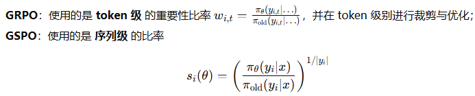
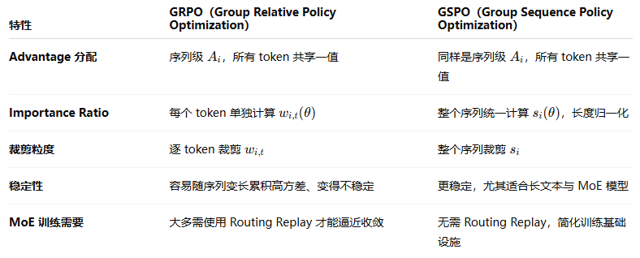
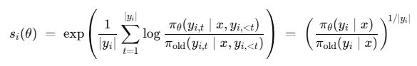
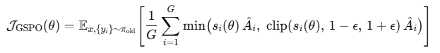
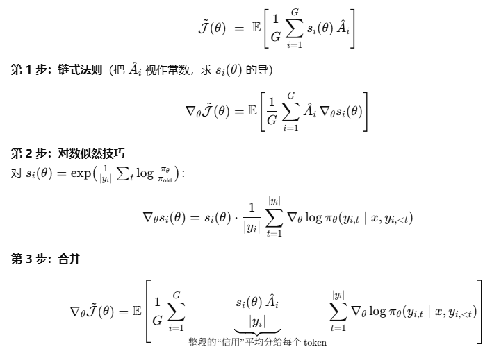

> 1、已经有GRPO了，为啥还要GSPO？GSPO的优势或改进在哪？

* Token-level 噪声累积带来的不稳定

  GRPO 在长生成中，**token1 的生成概率稍变、token2 微调等等，多个小变动叠加可能导致总梯度出现极端值，引发训练崩溃**。GSPO 采用整个序列（如一句完整解答）的 likelihood 进行重采样和平滑处理，**避免这种“局部波动”的放大效应**。
* MoE 模型中的export路径漂移

  某个 prompt 对应序列 A，会在 GRPO 中逐 token 优化，但**不同 token 可能激活不同export，路径不一致使 token-level 校正失效**。GSPO 一视整个生成路径，通过序列-level evaluator 保留稳定信号。实验证明在 MoE 架构下 GSPO 避免了如 “模型崩溃” 的现象，训练效率提升明显。
* math task inference中的性能对比

  在数学竞赛基准 AIME’24 上，GSPO 相比 GRPO 的模型表现提升约 15%；LiveCodeBench、CodeForces 上也分别有 22%、18% 左右提升。这说明 GSPO 在复杂推理任务上的鲁棒性更强、更能引导模型学习整体优化路径。
* 两者最大的关键区别：importance ratio和clip的颗粒度

    这是用整个seq的likelihood经过长度归一化(几何平均)得到的。然后 GSPO 在seq级别进行裁剪与优化，这使得训练更加稳定、方差更低(**用整个seq的ratio作为advantage的weight，比使用单个token的ratio更平滑、均匀，不会突然变得很大或很小**)！

总结：

2、GSPO公式推导：

2.1 GSPO不用逐 token 的比率，而是用**整段序列likelihood**的比率（并做长度归一），x是prompt，yi是response：

其中 |yi| 是响应长度。直观讲，这是把“整个response在new/old policy下的相对概率”做了 **几何平均** ，避免长序列因连乘而数值爆炸/下溢。

2.2  PPO 的保守更新思想是： **别让policy一步走太远** 。GSPO把这个“刹车”直接加在**序列比率**上:

同样使用clip的方案

2.3  为便于推导，先看**不含clip**的目标（clip分段处的导数在被截断区域为 0，可视作开关）

直观理解：对于同一个prompt，会让policy model生成多个response，然后逐一用reward model打分，每个response计算这个group内相对的advantage，然后把整个**response的advantage平均分给该段里的每个 token(除以|yi|)来计算gridant**，并且用old/new policy生成该response的概率比值si(seta)用来校正！

在 rollout 阶段，从old policy 采样 yi ，然后用new policy重计算 log-prob（cached KV 以加速）。这在 GSPO 中比 GRPO 更高效，因为避免 token-level 循环。
