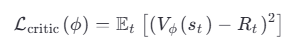
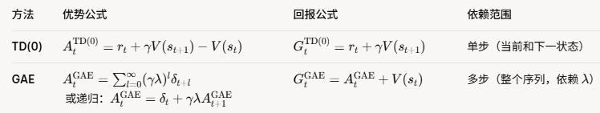
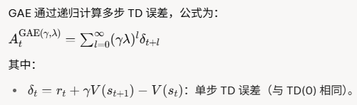

1、概述：  
* 纯文本LLM在pre-train阶段普遍使用auto regression方式，无需人工标注
* post-train阶段就要分情况了：
  * 传统的DPO/PPO需要人工标注数据：数学题需要题目、解题过程cot和最终答案
  * GRPO也需要人工标注数据：数学题只需要题目和答案，解题过程cot让LLM自行exploration
  * Test-Time Reinforcement Learning：数学题只需要题目，答案通过majority voting得到
  * Absolute Zero: Reinforced Self-play Reasoning with Zero Data：上述几种方法至少还需要使用人工生成或标注的data，这里的AZR连data都是LLM生成的：做数学题的时候题目、解题过程cot都是其他LLM生成的，完全不需要人工生成或标注数据了！
* 就现目前的技术手段而言，**train policy model肯定是需要数据的，否则哪来的信号让policy model做back propagation和梯度下降了**？如果不用人工标注，那就只能额外用其他的model产生数据了！这里就有点“节外生枝”了：**policy model都还没训练好了，生成数据的model该怎么收敛了？**
* 同理：**reward如果用专门的model来提供，reward model又该怎么收敛了？ critical如果也用专门的model来判断，那么critical model应该怎么收敛了**？  

2、policy model靠critical model和reward model提供的信号收敛：
* reward model：现成的，提供整个seq的整体reward，并不直接提供单个token的reward；
  * seq最后一个有效token的 reward = -kl_ctl * kl[:, t] + reward_clip (KL 散度加上 reward model 的裁剪奖励)
  * 其他有效token的reward = -kl_ctl * kl[:, t] (仅基于 KL 散度)
* critical model：提供V(s), 但本身也需要通过训练收敛的，这个又该怎么操作了？
  * loss如图所示：  
  * V(t)是critical model计算的state value, R(t)是累计的reward期望；业务意义就是**critical要能准确预测出当前state的value（才能给policy model提供准确的信号），这个value就是后续每个step产生reward的累计**
  * 现在的问题来了：R(t)就是后续每个step产生reward的累计，这个应该怎么计算了？TD或GAE方法！
    
    * TD：只看当前token的奖励和下一token的价值(bellman方程)
      * 可能忽略整个序列的连贯性；
      * 不涉及未来多步的随机性，方差低；依赖不准确的 V(s) ，初期可能偏差大，收敛困难；
    * GAE：结合整个seq的reward(policy model结束后才能评估整个seq的reward，计算量比TD大)，更准确地评估 token 对seq质量的贡献；
      * 更接近真实回报，偏差低；涉及更多未来奖励的随机性，方差高！
      * lambda 控制了未来奖励的影响范围（lambda = 0 时退化为 TD(0)，lambda = 1 时接近蒙特卡洛）