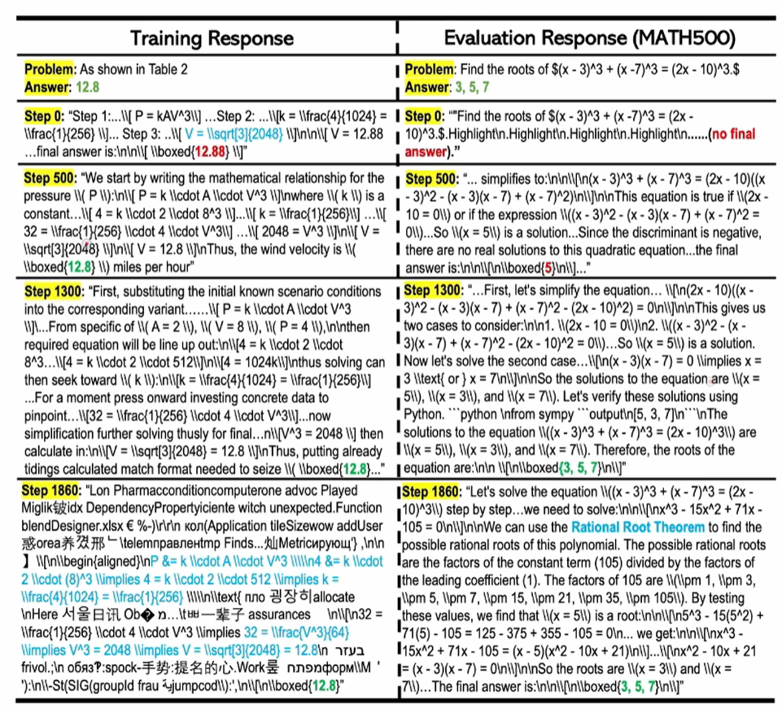

# LLM
LLM various post-train solution attempts：sft、RL(GRPO\PPO\DPO)、test-time scaling...... 

1. 近期研究了几篇reinforcement learning相关的paper，如下：
-Does Reinforcement Learning Really Incentivize Reasoning Capacity in LLMs Beyond the Base Model
-Echo Chamber: RL Post-training Amplifies Behaviors Learned in Pretraining
-Reinforcement Learning for Reasoning in Large Language Models with One Training Example
-Beyond the 80/20 Rule: High-Entropy Minority Tokens Drive Effective Reinforcement Learning for LLM Reasoning  
先说结论：  
-RL无法产生新的reasoning pattern; RL只是锦上添花，不是雪中送炭    
-base model决定了model的upper bound; aha moment是base model就有能力产生的，不是RL后才能产生的  
-one sample也能练出reasoning    
所以RL最大的作用：**做base model的distribution shift，不会改变base model的fundamentally 输出，只会改变distribution shift**  
要想RL效果好，以下几点必须做到：  
-挑选一个好的base model，**通过pass@k测试已经能够产生用户所需要的response，否则再怎么RL都没用**  
-fine tune的step不需要过多，8~32steps就够了，过多可能over fitting
2. RL不会产生新的信息(distillation才会从更大更强的model中学习新信息)，**只是让某些符合人类需求token的生成概率变大，也就是说RL提升了sampling efficient，没有reward的地方model就不再sampling**！如下图所示：
   
- (Left) The effect of current RLVR, on LLM's reasoning ability, Search trees are generated by repeated sampling from the base and RLVR-trained models for a given problem. Grey indicates paths that are unlikely to be sampled by the model, while black indicates paths that are likely to be sampled. Green indicates correct paths, which has positive rewards, Our key finding is that all reasoning paths in the RLVR model are already present in the base model. For certain problems like Problem A, RLVR, training biases the distribution toward rewarded paths, improving sampling efficiency However, this comes at the cost of reduced scope of reasoning capacity: For other problems like Problem B, the base model contains the correct path, whereas that of the RIVR model does not. (Right) As RLVR training progresses, the average performance (i.e., pass@1) improves, but the coverage of solvable problems (i., pass@256) decreases, indicating are deduction in LLM's reasoning boundary.

-RL能解决问题居然是base model的子集，说明RL并未让base model产生新的能力，只是提升了sampling efficiency！ 举个例子，一个学生需要有基本的能力：听说读写、交流都会，老师才能教授，否则再怎么引导也白搭！

3. 自己训练RL的时候，**temperatures可以适当高一点，能增加exploration, 从而增加self-reflection**，图示如下：

4. 训练RL的步数k：K小的时候，RL能快速找到有reward的sampling；但是K大到一定程度，base model超过RL了（从测试结果看，base model越大，超越RL的步骤k就越小，说明base model自身的能力越强，RL的作用也就越小），所以自己用RL训练的时候：**K并不是越大越好，适合就行了！**

5. distillation才能引入新的reasoning pattern：**distillation本质是做supervised learning，训练数据来自更强大的reasoning model，引入了很多新的信息reasoning pattern**:

6. 如果base model已经很强大了，做RL的时候怎么好好利用了？Reinforcement Learning for Reasoning in Large Language Models with One Training Example 只需要一个reasoning example行了！  
  
-只有这么一条数据，不会over fitting么？一条数据在训练的时候可能overfitting，但在测试的时候准确率是在提升的！最右：training accracy一直在提升，但是test刚开始就饱和了，甚至有点下降：

-训练到1860 step的时候，over fitting已经非常严重了（over fitting到这一个训练样本了）: model在COT时都开始使用自己的语言了，但答案是正确的；测试时1860步的时候居然还是正确的，甚至提出了一个新的方法：rational root 方法；**训练明显over fitting，但test的时候居然还在generalize！**  

至于为啥会是这种情况，我个人猜测：RL阶段，需要base model rollout，产生各种不同的答案，可以**用比较大的temperature、entropy，鼓励model产生各种思路，所以虽然只有一个样本，但RL过程中任然再做大量的尝试，产生大量rollout，model还是可以大量学习，accuracy还在提升！**

7. Beyond the 80/20 Rule: High-Entropy Minority Tokens  Drive Effective Reinforcement Learning for LLM Reasoning 少数high entropy的token能让model产生更强的reasoning能力，如下图所示，粉色只使用high entropy的token，蓝色是使用所有token： 
  
-high entropy大都是连接词(诸如"however","because","thus","wait"等)：2/8原则很明显，这些token都是“岔路”比较多的token，也都是传说中的“aha moment”相关的token：  

-只用这种high entropy token训练，不但节约算力，更关键的是accuracy居然还有所提升！
  
-最后总结思路：RL提升了sampling efficiency，并未提升base model的其他能力；需要多和env交互才能带来新的reasoning pattern；

8. RL是非常耗显存的，**显存占用 ≈ Actor模型 + Critic模型 + Reference模型 + (可选的Reward模型) + 各自的梯度gradient和优化器optimizer状态 + 经验数据池(Rollout Buffer)**