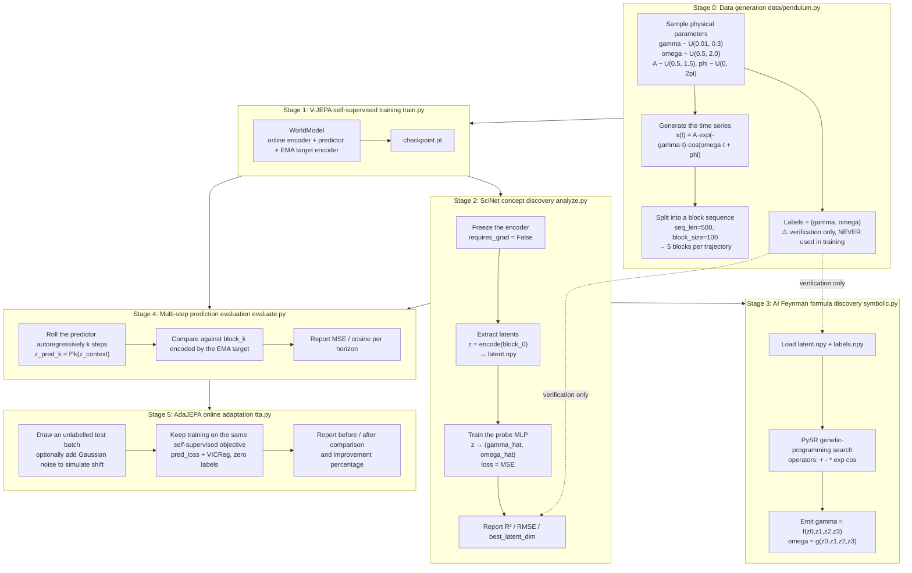
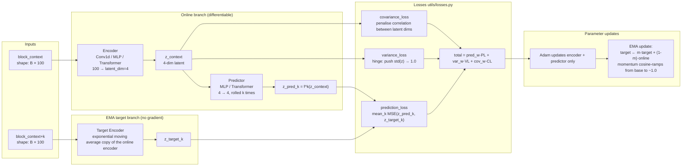
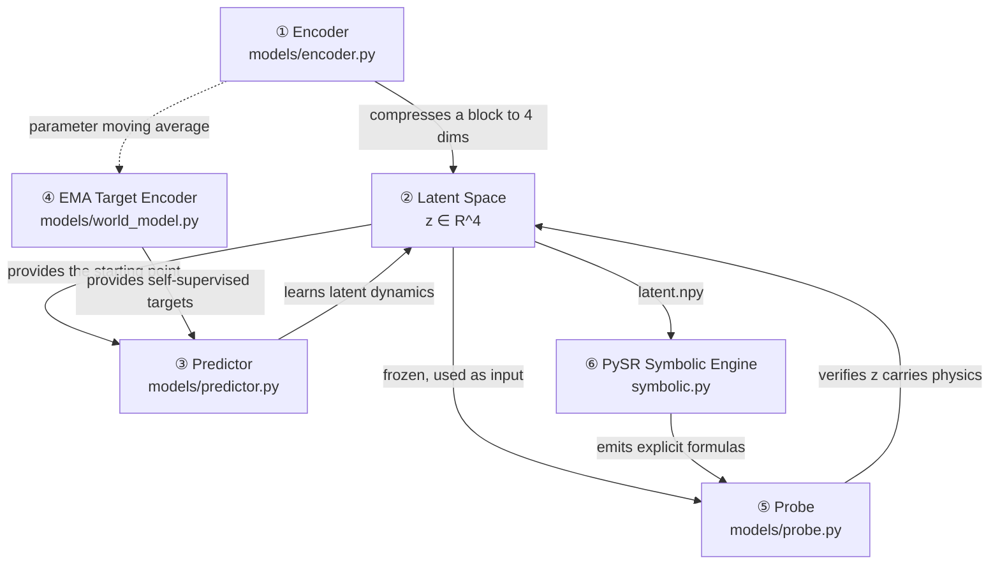
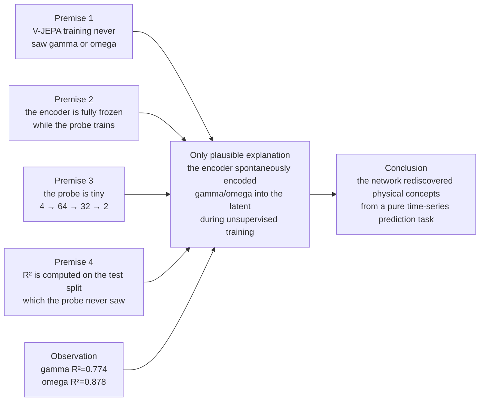
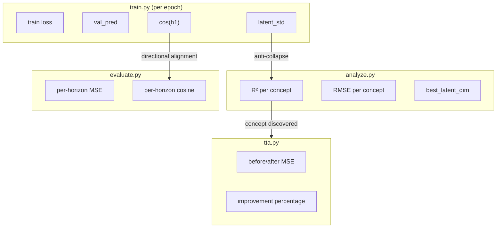
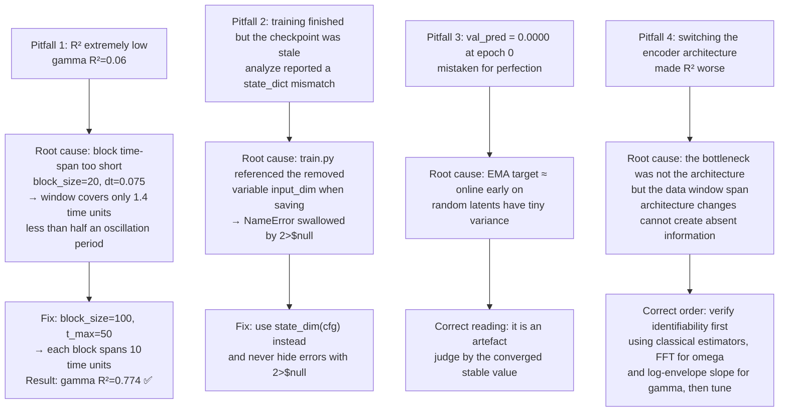
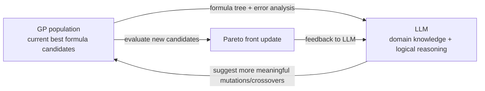

# SciNet++ (2026)

A modern, minimal re-implementation and upgrade of **"Discovering Physical
Concepts with Neural Networks"** (Iten et al., 2018). The original SciNet is
~8 years old and its software stack is no longer maintained, so this project
rebuilds the *core idea* -- a neural network that discovers interpretable
physical concepts from raw trajectories -- on top of current components and
connects four research threads into one runnable platform:

```
SciNet            AI Feynman           V-JEPA                AdaJEPA
(concept          (formula             (latent               (online
 discovery)        discovery)           prediction)           adaptation)
     |                 |                    |                     |
 analyze.py        symbolic.py           train.py /            tta.py
 (physics          (PySR on the          evaluate.py
  probe)            latents)             (EMA target +
                                          multi-step +
                                          VICReg)
```

Instead of reconstructing its input (2018 SciNet), the representation learner
here **predicts future latent representations** (the modern JEPA principle
behind V-JEPA / SkyJEPA / AdaJEPA), regularised so the latent space cannot
collapse.

---

## What the model learns

For the primary dataset -- a damped harmonic oscillator

```
x(t) = A * exp(-gamma * t) * cos(omega * t + phi)
```

the two ground-truth physical concepts are the damping rate `gamma` and the
angular frequency `omega`. Nothing about them is given to the representation
learner. If the pipeline works, the frozen latent space should

1. predict future latents well over multiple horizons (V-JEPA),
2. let a tiny linear/MLP **probe** recover `gamma` and `omega` (SciNet),
3. let **PySR** propose an explicit formula from latents to concept (AI Feynman),
4. keep improving on new data with **no labels** (AdaJEPA).

---

## Installation

```bash
pip install -r requirements.txt
```

Notes:
- CUDA is used automatically if available, otherwise everything falls back to CPU.
- `pysr` (the AI-Feynman stage) is Julia-backed and downloads a self-contained
  Julia toolchain on first use (a few minutes, one time). If you cannot install
  it, run the rest of the pipeline with `--skip-symbolic` (see below); all other
  stages work without it.

---

## Quick start

Run the entire pipeline with one command:

```bash
python run_all.py --config configs/pendulum.yaml
```

Or a fast smoke run (few epochs, no Julia needed):

```bash
python test_data.py                                             # data sanity
python run_all.py --config configs/pendulum.yaml --epochs 3 --skip-symbolic
```

Run stages individually (order matters -- later stages consume earlier outputs):

```bash
python train.py     --config configs/pendulum.yaml     # 1. learn representations (V-JEPA)
python analyze.py   --config configs/pendulum.yaml     # 2. physics probe (SciNet) + save latents
python symbolic.py  --config configs/pendulum.yaml     # 3. formula discovery (AI Feynman / PySR)
python evaluate.py  --config configs/pendulum.yaml     # 4. multi-step latent evaluation
python tta.py       --config configs/pendulum.yaml     # 5. online adaptation (AdaJEPA)
```

Every script accepts `--config`; `tta.py` also accepts `--noise-std 0.05` to
simulate a deployment shift, and `train.py` accepts `--epochs N`.

---

## Chaotic double pendulum (multivariate path)

The encoder/predictor are state-dim agnostic, so the same pipeline runs on the
4-D chaotic double pendulum, where the discovered concept is the conserved total
mechanical energy `E`:

```bash
python run_all.py --config configs/double_pendulum.yaml --skip-symbolic
```

---

## Repository layout

```
configs/
  pendulum.yaml          # primary 1D experiment (drives every stage)
  double_pendulum.yaml   # chaotic 4D experiment
data/
  pendulum.py            # damped oscillator generator (concepts: gamma, omega)
  double_pendulum.py     # chaotic generator (concept: total energy)
  dataset.py             # block-sequence dataset + config-driven factory
models/
  encoder.py             # configurable MLP concept extractor (+ build_mlp)
  predictor.py           # latent transition model f (one block ahead)
  world_model.py         # V-JEPA: online encoder + predictor + EMA target
  probe.py               # physics probe read-out (SciNet)
utils/
  losses.py              # multi-step prediction loss + VICReg (anti-collapse)
  metrics.py             # MSE/RMSE/R2, cosine sim, latent-std collapse watch
  plotting.py            # headless-safe figures for every stage
  seed.py                # reproducibility
  config.py              # YAML loading + device/output resolution
train.py  analyze.py  symbolic.py  evaluate.py  tta.py  run_all.py  test_data.py
```

---

## How it works (design decisions)

### Block-wise multi-step latent prediction (V-JEPA)
Each trajectory of length `L` is split into `num_blocks = L / block_size`
consecutive blocks. The encoder maps one block to a latent `z_b`; the predictor
`f` is rolled autoregressively to predict future latents
`z_{b+k} = f^k(z_b)` for every horizon `k` in `jepa.rollout_steps`. The **same**
`f` is used for training and evaluation, so the reported multi-step numbers are
meaningful.

### No collapse: EMA target encoder + VICReg
Targets come from an **EMA copy** of the online encoder (no gradient). On top of
the prediction MSE, a **VICReg** variance + covariance penalty on the online
latents forces each latent dimension to carry independent, non-constant
information. This removes the trivial "encode everything to a constant"
solution that a shared-encoder + plain-MSE JEPA collapses into. The mean latent
std is logged to TensorBoard as a live collapse diagnostic.

### Physics probe (SciNet) and formula discovery (AI Feynman)
`analyze.py` freezes the encoder, trains a small probe on the latents to regress
the true concepts, and reports per-concept `R^2` / `RMSE`. It also saves
`latent.npy`, `labels.npy`, per-concept `<name>.npy` and `label_names.json`,
which `symbolic.py` (PySR) consumes to search for a closed-form equation.

### Online adaptation (AdaJEPA)
`tta.py` keeps minimising the **self-supervised** JEPA objective on an unlabelled
test batch at deployment time (adapting the predictor, and optionally the
encoder + EMA target), reporting the improvement in latent prediction error with
no labels used.

---

## Outputs

Everything is written to `output_dir` from the config (`outputs/` by default):

| File | Produced by | Meaning |
|------|-------------|---------|
| `checkpoint.pt` | `train.py` | online encoder + predictor + EMA target + resolved config |
| `tb/` | `train.py` | TensorBoard logs (losses, per-horizon cosine, latent std) |
| `latent.npy`, `labels.npy`, `<concept>.npy`, `label_names.json` | `analyze.py` | frozen test latents + concept targets |
| `pca.png`, `latent_vs_<concept>.png`, `probe_parity.png` | `analyze.py` | concept-discovery figures |
| `equations_<concept>.txt/.csv` | `symbolic.py` | PySR discovered formulas |
| `horizon_mse.png`, `horizon_cosine.png`, `horizon_metrics.npy` | `evaluate.py` | multi-step prediction quality |

View training logs with:

```bash
tensorboard --logdir outputs/tb
```

---

## Relationship to the original SciNet (2018)

| Aspect | SciNet 2018 | SciNet++ 2026 (this repo) |
|--------|-------------|---------------------------|
| Objective | reconstruct / predict observations | predict **latent** representations (JEPA) |
| Target network | same encoder | **EMA** target encoder |
| Anti-collapse | information bottleneck | **VICReg** variance + covariance |
| Prediction | single step | **multi-step** rollout over horizons |
| Concept read-out | human inspection | **physics probe** (R^2/RMSE) |
| Formula discovery | none | **PySR / AI Feynman** |
| Adaptation | none | **AdaJEPA** test-time adaptation |

The spirit is unchanged -- *discover the minimal physical concepts that explain
the data* -- but the machinery is 2026-current and the four threads are wired
into a single reproducible pipeline.

---

# Systematic Reference: Architecture, Training Mechanism and Metrics Handbook

> Numbers quoted below come from a reference run of `configs/pendulum.yaml`
> (300 epochs, 50k train samples, GTX 1050 Ti 4 GB).

## 1. End-to-end pipeline (how the five stages chain together)



**Key dependency relationships**:

| Dependency | Explanation |
|---|---|
| Stage 0 → 1 | Training consumes the time-series blocks and does **not** need labels |
| Stage 1 → 2 | `analyze.py` must load `checkpoint.pt`, otherwise there is no encoder |
| Stage 2 → 3 | `symbolic.py` must read the `latent.npy` / `labels.npy` produced by `analyze.py` |
| Stage 1 → 4 | `evaluate.py` loads the same checkpoint and reuses the predictor for rollouts |
| Stage 4 → 5 | `tta.py` is logically an extension of `evaluate.py`: measure baseline, adapt, measure again |
| Labels (G4) | Flow **only** to A4 and Y1 (dashed lines); they never enter the training loss |

---

## 2. Inside V-JEPA (stage 1 expanded)



### Why is the EMA target encoder mandatory?

If the online and target encoders were the **same** network (shared weights), the
model would immediately find a cheating solution: map every input to one constant
vector `c`. Then `MSE(pred, target) = 0` -- a perfect loss with a latent space
carrying zero information. This is **representation collapse**.

The EMA target breaks that cheating path: the target encoder receives no gradient,
it is merely a running average of the online encoder's history. The online encoder
cannot "order" the target to collapse along with it, because target updates always
lag and are not directly controlled by the current gradient. VICReg's variance term
then applies pressure from the other side: any dimension with `std < 1.0` is
penalised, making the constant solution numerically unattainable. Only the two
mechanisms together make a JEPA trainable.

---

## 3. Module-by-module: role, training procedure, and evidence of "understanding physics"



| Module | Role | How it is trained | Loss | Sees labels during training? | How it evidences "understanding physics" |
|---|---|---|---|---|---|
| **① Encoder** | Compresses a 100-step time-series block into a 4-dim latent | Jointly with the predictor; Adam + cosine annealing | pred_loss + VICReg | ❌ Never | It must find, unsupervised, the variables that make the future predictable -- physically those can only be gamma/omega |
| **② Latent Space** | The 4-dim concept space | -- (output of the encoder) | -- | -- | If z0 correlates with omega and z1 with gamma, the concepts have been **spontaneously separated** onto different axes |
| **③ Predictor** | Transition function `f` in latent space, rolled k times to forecast the future | Jointly with the encoder | same as above | ❌ | `f^k(z)` approaching `z_{t+k}` shows it learned an **evolution law**, not a memorised fixed mapping |
| **④ EMA Target Encoder** | Supplies stable prediction targets | No gradient; only `target ← m·target+(1-m)·online` | none | ❌ | The key anti-collapse mechanism, keeping the latent from degenerating to a constant |
| **⑤ Probe** | Tests whether z contains gamma/omega | A small MLP trained separately on **frozen** latents | MSE(probe(z), y_true) | ✅ Labels used only here | Tiny-capacity MLP + frozen encoder → a high R² can only mean "the information was already in z" |
| **⑥ PySR** | Turns implicit knowledge into explicit formulas | Genetic programming (evolutionary, not gradient descent) | Pareto front: accuracy vs simplicity | ✅ | Emits a human-readable `gamma ≈ f(z0..z3)`, closing the AI-Feynman loop |

### The complete argument that "the network understands the physics"



**Proof by contradiction**: suppose z carried no gamma information (just four
numbers unrelated to the physics). Then no probe, however large, could predict
gamma from z -- the information simply does not exist. An R² of 0.774 means the
probe explained 77.4% of gamma's variance, which information-theoretically
requires z to carry gamma information. That information can only have come from
the encoder learning it during self-supervised training, because there is no other
source.

---

## 4. Metrics handbook: formulas, meaning, healthy ranges, worked examples

### 4.1 Which stage produces which metric



### 4.2 Metric-by-metric detail

#### ① `train` -- total training loss

**Source**: `train.py:155` → `loss = pred_weight * pred_l + vic_l`

**Formula**:
```
train = pred_w · mean_k MSE(z_pred_k, z_target_k) + var_w · VarLoss(z) + cov_w · CovLoss(z)
```

**Meaning**: the overall optimisation objective -- the prediction term plus two
anti-collapse regularisers.

**Healthy range**: monotonically decreasing to convergence. Reference run:
6.79 → 0.010 ✅

**Caution**: the large initial value (~6.8) happens because a randomly initialised
encoder produces latents whose variance is far below 1.0, so the variance hinge is
heavily penalised. This is expected behaviour, not a bug.

---

#### ② `val_pred` -- pure validation prediction MSE

**Source**: called at `train.py:222-224` → computed in `utils/losses.py:43-50` → aggregated at `train.py:235`

**Formula**:
```
val_pred = mean_over_batches( mean_over_horizons( MSE(z_pred_k, z_target_k) ) )
```

**Meaning**: **excludes VICReg** -- pure prediction quality. A cleaner signal of
model quality than the total training loss.

**Healthy range**: ~0.001 - 0.01

**Caution (important trap)**: `val_pred` at epoch 0 is often 0.0000. This is
**not** perfect prediction -- it is an artefact. Early in training the EMA target
encoder is nearly identical to the online encoder (momentum is still low), and a
random encoder emits latents with very small, similar variance, so their difference
is naturally close to zero. As training progresses the EMA diverges and `val_pred`
rises to its true level (~0.008) and stabilises.

**Overfitting signal**: training loss keeps falling while `val_pred` keeps rising.
The reference run stabilised at 0.008 → no overfitting ✅

---

#### ③ `latent_std` -- the collapse diagnostic

**Source**: `train.py:176` → `utils/metrics.py:97-108`

**Formula**:
```
latent_std = mean_j( std_i(z_ij) )
where i ranges over samples and j over latent dimensions
```
That is: compute the across-sample standard deviation of each latent dimension,
then average over dimensions.

**Meaning**: VICReg aims for per-dimension std ≈ 1.0. This is the only direct
monitor of **representation collapse**.

**Healthy range**:

| Value | Meaning |
|---|---|
| ~0.0 | ❌ **Full collapse**: every input maps to the same point, all information lost |
| < 0.3 | ⚠️ Collapse risk; concepts cannot possibly be discovered |
| 0.8 - 1.5 | ✅ Healthy |
| > 3.0 | ⚠️ Excessive variance; training may be unstable |

**Worked example** -- a batch of 3 samples with latent_dim=4:
```
           z0     z1     z2     z3
sample 1   0.8    1.2   -0.3    0.5
sample 2   0.3    0.8    0.1   -0.2
sample 3  -0.1    0.3    0.5    0.9

std(z0)=0.45, std(z1)=0.45, std(z2)=0.40, std(z3)=0.55
latent_std = mean(0.45,0.45,0.40,0.55) = 0.46   ⚠️ on the low side
```
If all three samples had z = `[0.5, 0.5, 0.5, 0.5]`, every std would be 0 →
latent_std = 0 → full collapse.

Reference run: 1.04 → 1.13, healthy throughout ✅

---

#### ④ `cos(h1)` -- one-step directional alignment

**Source**: `train.py:227-229` → `utils/metrics.py:71-94`

**Formula**:
```
cos(h1) = mean_samples( (z_pred_1 · z_target_1) / (|z_pred_1| × |z_target_1|) )
```

**h1 = horizon 1**: starting from the context block, the predictor is rolled
**one step** to predict the next block's latent.

**Why is cosine more robust than MSE?** Example, with target = `[1.0, 0.0]`:

| Prediction | MSE | Cosine | Actual quality |
|---|---|---|---|
| `[0.9, 0.1]` | 0.01 | 0.995 | ✅ Right direction, right magnitude |
| `[2.0, 0.0]` | **1.00** | **1.000** | ⚠️ Direction exactly right, only the scale is off |
| `[0.0, 1.0]` | **1.00** | **0.000** | ❌ Same magnitude but completely wrong direction |

MSE scores the last two identically (1.0), yet the second is clearly far better
than the third. VICReg only pushes std≈1 without pinning the exact scale, so the
global latent scale drifts within roughly 0.8-1.3 and contaminates the MSE.
**Cosine ignores scale entirely** and answers a single question: did the predictor
point in the right direction?

**Healthy range**:

| Value | Meaning |
|---|---|
| > 0.95 | ✅ Excellent |
| 0.85 - 0.95 | ⚠️ Usable, room for improvement |
| < 0.5 | ❌ The predictor did not learn the dynamics |

Reference run: 0.967 → 0.985 ✅

---

#### ⑤ `R²` -- coefficient of determination (the core evidence of concept discovery)

**Source**: `analyze.py:145` → `utils/metrics.py:41-68`

**Formula**:
```
R² = 1 - SS_res / SS_tot
SS_res = Σ(y_true - y_pred)²      residual sum of squares
SS_tot = Σ(y_true - ȳ_true)²      total variance of the ground truth
```

**What the four symbols mean** (the most commonly confused point):

| Symbol | Meaning | Origin |
|---|---|---|
| `y_true` | ground-truth gamma / omega | sampled by `np.random.uniform` at data-generation time, stored in `labels.npy` |
| `y_pred` | probe prediction | output of `probe(z)`, de-standardised back to original units |
| `ȳ_true` | mean of y_true | a scalar representing "the dumbest possible baseline" |
| `z` | frozen latent | `encoder(block_0)` |

**Intuition**:
- denominator = "how wrong you are if you learn nothing and just predict the mean"
- numerator = "how wrong the probe actually is"
- R² = "what fraction better the probe is than predicting the mean"

**Full worked example** (gamma, 5 test samples):
```
sample   y_true   y_pred   y_true-y_pred   y_true-ȳ_true
───────────────────────────────────────────────────────
  1      0.05     0.06       -0.01          -0.10
  2      0.10     0.11       -0.01          -0.05
  3      0.15     0.14       +0.01           0.00
  4      0.20     0.22       -0.02          +0.05
  5      0.25     0.24       +0.01          +0.10
                             ȳ_true = 0.15

SS_res = 0.0001+0.0001+0.0001+0.0004+0.0001 = 0.0008
SS_tot = 0.0100+0.0025+0.0000+0.0025+0.0100 = 0.0250

R² = 1 - 0.0008/0.0250 = 1 - 0.032 = 0.968
```

**Healthy range**:

| Value | Meaning |
|---|---|
| > 0.9 | ✅✅ Concept strongly discovered |
| 0.5 - 0.9 | ✅ Concept discovered (gamma=0.774 sits here) |
| 0.1 - 0.5 | ⚠️ Partially encoded; needs improvement |
| ≤ 0 | ❌ **Not discovered**; worse than predicting the mean |

**Caution (the biggest pitfall hit in this project)**: when R² is very low (~0.06),
do not first suspect the encoder architecture -- first check the **block time-span**.
`analyze.py` encodes only block 0, so if `block_size × dt` covers just 1.4 time
units, the window contains less than half an oscillation period and negligible
decay → gamma and omega are **information-theoretically unidentifiable**, and no
encoder change can help. Fix: `block_size=100`, `dt≈0.1` → each block spans 10
time units, and R² rose to 0.59 / 0.82.

---

#### ⑥ `RMSE` -- root mean squared error

**Source**: `analyze.py:151` → `utils/metrics.py:32-38`

**Formula**:
```
RMSE = sqrt( (1/N) Σ(y_true - y_pred)² ) = sqrt(MSE)
```

**Meaning**: average error magnitude in the **same units** as the original data.
R² is a relative metric; RMSE is an absolute one.

**Caution: a high R² together with a large RMSE is perfectly normal.** For omega
in the reference run: R²=0.878 (high relative accuracy) yet RMSE=0.1518 (large
absolute error). The reason is that omega spans [0.5, 2.0] -- a range of 1.5 --
while gamma spans only [0.01, 0.3], a range of 0.29. Always normalise by the range
before judging error magnitude:

```
gamma: RMSE / range = 0.0404 / 0.29 = 13.9%
omega: RMSE / range = 0.1518 / 1.50 = 10.1%   ← omega is actually more accurate
```

---

#### ⑦ `best_latent_dim` -- locating a concept

**Source**: `analyze.py:69-78`

**Formula**:
```
corr_j   = Pearson(z_j, y) = Σ(standardised z_j · standardised y) / N
best_dim = argmax_j |corr_j|
```

**Meaning**: tells you which latent dimension "carries" a given physical concept.
This is the direct evidence for SciNet's claim that concepts separate automatically.

**Worked example** (5 samples, 4-dim latent, concept = gamma):
```
sample   z0     z1     z2     z3     gamma
───────────────────────────────────────────
  1     0.8    1.2   -0.3    0.5     0.05
  2     0.3    0.8    0.1   -0.2     0.10
  3    -0.1    0.3    0.5    0.9     0.15
  4    -0.5   -0.2    0.8    1.1     0.20
  5    -0.9   -0.7    1.2    1.5     0.25

Pearson correlations:
corr(z0, gamma) = -0.97   ← largest |corr|
corr(z1, gamma) = -0.95
corr(z2, gamma) = +0.88
corr(z3, gamma) = +0.72

→ best_latent_dim = z0
```

**Caution: the absolute value is taken**, so a negative correlation still counts as
"strongly correlated". A correlation of -0.97 between z0 and gamma means larger z0
implies smaller gamma -- equally rich in information, just inverted. The probe learns
that sign automatically.

In the actual reference run: omega→z0 and gamma→z1, i.e. **the two physical
quantities were assigned to different dimensions**. That is precisely the effect of
VICReg's covariance penalty.

---

#### ⑧ Per-horizon MSE / cosine -- multi-step prediction quality

**Source**: `evaluate.py:47-85`

**Formula**, for each horizon k ∈ {1,2,3,4}:
```
MSE_k    = mean_batches( mean( (f^k(z_ctx) - target_encoder(block_k))² ) )
cosine_k = mean_batches( mean_samples( cos(f^k(z_ctx), target_encoder(block_k)) ) )
```

**What "horizon" means** (a key concept): the data is cut into 5 blocks; starting
from block_0:
```
[block_0 | block_1 | block_2 | block_3 | block_4]
    ↑ context
    │
    ├─ horizon=1 → roll 1 step, predict block_1's latent
    ├─ horizon=2 → roll 2 steps, predict block_2's latent
    ├─ horizon=3 → roll 3 steps, predict block_3
    └─ horizon=4 → roll 4 steps, predict block_4
```
**Crucial detail**: in `world_model.py:82-97` the k-step rollout applies the
**same** predictor k times, rather than using a separate network per horizon. That
is what makes it a genuine learned transition function.

**Reference results**:
```
horizon |   MSE    | cosine
   1    | 0.00782  | 0.9845
   2    | 0.01176  | 0.9697
   3    | 0.00809  | 0.9779
   4    | 0.00519  | 0.9841
```

**Cautions**: MSE is **not necessarily monotonic in the horizon**. Here h2 is the
largest (0.0118) while h4 is the smallest (0.0052). This is not a bug. The reason
is that during training the context block is **randomly sampled** (`train.py:143`)
whereas evaluation fixes it at block 0. Different block positions correspond to
different physical states (by block_4 the amplitude has decayed substantially, so
the latent sits closer to the origin and the MSE is naturally smaller). **When
comparing across horizons, prefer cosine**, which is scale-free: 0.9697-0.9845
stays high throughout, showing the direction remains accurate after 4 steps.

---

#### ⑨ TTA improvement percentage

**Source**: `tta.py:148-152`

**Formula**:
```
delta = 100% × (mean_MSE_before - mean_MSE_after) / mean_MSE_before
```

**Meaning**: the magnitude of self-improvement achieved with **zero labels**. This
is the core value proposition of AdaJEPA.

**Why can it adapt without labels?** Because the JEPA training objective itself
needs no labels: predict future latents + VICReg, with targets supplied by the EMA
encoder (a self-supervised reference). The same objective therefore remains usable
at deployment time.

**Reference result**: +13.54% (0.00905 → 0.00782) after 25 gradient steps, zero
labels ✅

**Cautions**:
- By default only the **predictor** adapts; the encoder stays frozen. This is
  deliberate: it avoids destroying the already-learned representation.
- VICReg must be kept during TTA, otherwise a few dozen gradient steps are enough
  to collapse the latent space.
- If `adapt_encoder=True`, the EMA target must be updated as well
  (`tta.py:128-129`), otherwise the target gradually becomes stale.
- Typical improvement is 5%-20%. If you observe **negative improvement**, first
  check whether the learning rate is too high or the step count too large.

---

### 4.3 Metrics quick-reference table

| Metric | Stage | Source location | Core formula | Healthy value | What it tells you |
|---|---|---|---|---|---|
| `train` | train | losses.py:27-86 | pred_MSE + VICReg | monotonically decreasing | is it converging |
| `val_pred` | train | train.py:222-235 | mean_k MSE | 0.001-0.01 | is it overfitting |
| `latent_std` | train | metrics.py:97 | mean_j std_i(z_ij) | 0.8-1.5 | **has it collapsed** |
| `cos(h1)` | train | metrics.py:71 | mean cosine | >0.95 | directional alignment |
| `R²` | analyze | metrics.py:41 | 1 - SS_res/SS_tot | >0.5 | **was the concept discovered** |
| `RMSE` | analyze | metrics.py:32 | sqrt(MSE) | judge relative to range | absolute accuracy |
| `best_dim` | analyze | analyze.py:69 | argmax\|Pearson\| | -- | which dim holds the concept |
| `MSE_k` | evaluate | evaluate.py:60 | MSE per horizon | <0.02 | multi-step accuracy |
| `cosine_k` | evaluate | evaluate.py:61 | cosine per horizon | >0.95 | **multi-step alignment** |
| `TTA delta` | tta | tta.py:150 | relative improvement % | +5% to +20% | label-free adaptability |

---

## 5. Cautions and pitfalls already encountered



### Key engineering principles

1. **Verify identifiability before optimising architecture.** Run classical
   estimators (FFT peak for omega, log-envelope slope for gamma) on the raw signal
   and compute their R² to obtain the theoretical ceiling. If classical methods
   cannot recover the concept, no neural network can either -- the problem is in the
   data, not the model.

2. **Labels must never enter the training loss.** How to check: search `train.py`
   for any reference to `batch["labels"]`. In this project `train.py` reads only
   `batch["blocks"]` ✅

3. **The encoder must be frozen before the probe trains.** The
   `requires_grad_(False)` at `analyze.py:117-118` is the precondition for the whole
   argument; removing it invalidates the entire SciNet claim.

4. **Never use `2>$null` in PowerShell.** It swallows every error and makes failures
   look like successes -- which is exactly how pitfall 2 happened.

5. **The config is the single source of truth.** All dimensions (`block_size`,
   `latent_dim`, hidden sizes, rollout steps) are read from YAML with no numbers
   hardcoded in the code; otherwise config changes fail silently.

---

## 6. The ultimate form: Neuro-Symbolic AI -- fusing neural networks with symbolic reasoning

Neural networks (NNs) and genetic programming (GP) each have complementary
strengths and weaknesses. One of the most active frontiers in AI research is
combining the two -- and SciNet++ is architecturally aligned with this direction.

### 6.1 NN for feature extraction + GP for formula discovery

This is exactly how the current SciNet++ pipeline is designed:

```
Raw high-dimensional time series → [Encoder (NN)] → Low-dim latent embedding (z₀..z₃) → [PySR (GP)] → Interpretable mathematical formula
```

| Component | Role | Problem it solves |
|---|---|---|
| **Encoder (NN)** | Compresses a 100-step time series into a 4-dim latent | GP searching directly on high-dimensional raw data hits the **curse of dimensionality** -- the search space explodes exponentially. The NN first reduces to a semantically rich low-dimensional representation, making GP's search tractable |
| **PySR (GP)** | Searches for explicit formulas on the latents | NNs are black boxes that cannot produce human-readable expressions. GP outputs symbolic formulas like `gamma ≈ f(z₀,z₁,z₂,z₃)`, giving the entire system **interpretability** |

This is the core idea of Neuro-Symbolic AI: **the NN handles "perception"**
(extracting structured representations from high-dimensional data), while **GP
handles "reasoning"** (discovering interpretable laws from those
representations). The two are complementary and neither suffices alone.

SciNet++'s `train.py → analyze.py → symbolic.py` pipeline is a complete
implementation of this paradigm.

### 6.2 LLM-guided GP evolution

Traditional GP mutation is **blind**: randomly swapping `+` for `*`, randomly
replacing subtrees, randomly inserting nodes. This undirected search is
inefficient and prone to getting stuck in local optima.

The frontier approach introduces a large language model (LLM) as a **heuristic
tutor**:



Concrete workflow:

1. **When GP stalls** (no Pareto-front improvement for several generations),
   send the current best formula tree, error distribution, and domain knowledge
   (e.g. "this is a damped oscillator", "energy should be conserved") to the LLM
   as a prompt.
2. **The LLM proposes logically motivated mutations**: e.g. "the current formula
   lacks a decay term; try introducing `exp(-x₂)`", or "the argument of `cos`
   should be a linear combination rather than a single variable".
3. **GP adopts the suggestions** to generate new candidates, which are more
   likely to escape local optima than blind random mutations.
4. **Reported effect**: 2-10× improvement in search efficiency, especially on
   physical formula discovery tasks.

### 6.3 How SciNet++ connects to this frontier

The current `symbolic.py` already exposes extension points for PySR:

- **NN+GP fusion**: already the status quo. Latents produced by the encoder are
  fed directly to PySR with no modifications needed.
- **LLM-guided GP**: PySR supports custom `warmup_maxsize_by_iter` and callback
  functions. An LLM call can be added inside `discover_formula` to analyse the
  current Pareto front after each generation and dynamically adjust operator
  weights or inject prior constraints for the next generation.
- **Deeper fusion**: in the future the LLM could participate in encoder design
  (e.g. suggesting inductive biases based on domain knowledge), or formulas
  discovered by GP could feed back into encoder training (as regularisation
  terms).

None of these extensions require changing the core pipeline structure --
SciNet++'s modular design naturally supports incremental evolution toward fuller
Neuro-Symbolic integration.

