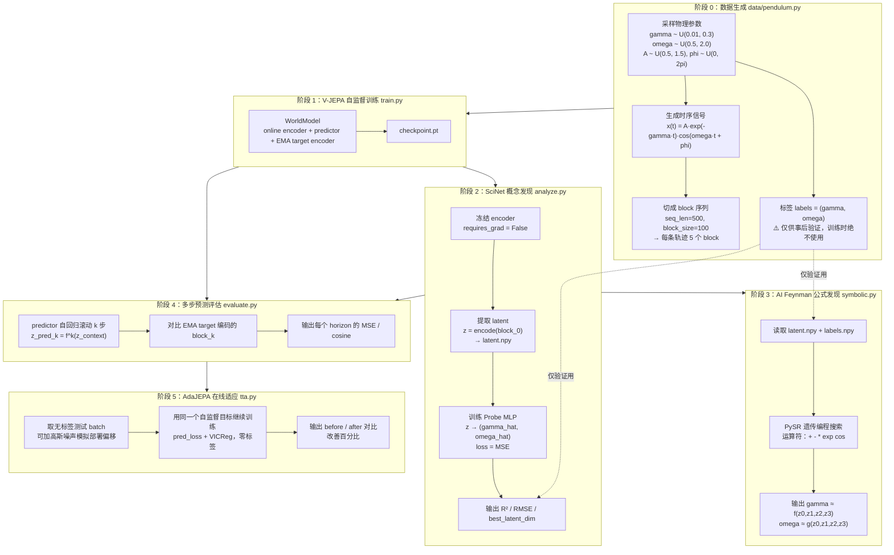
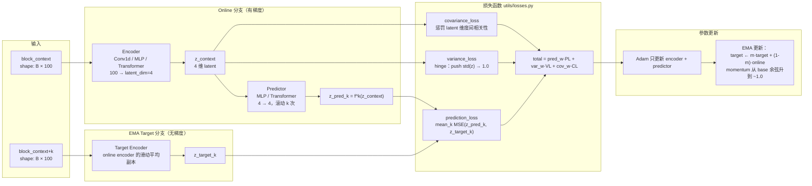
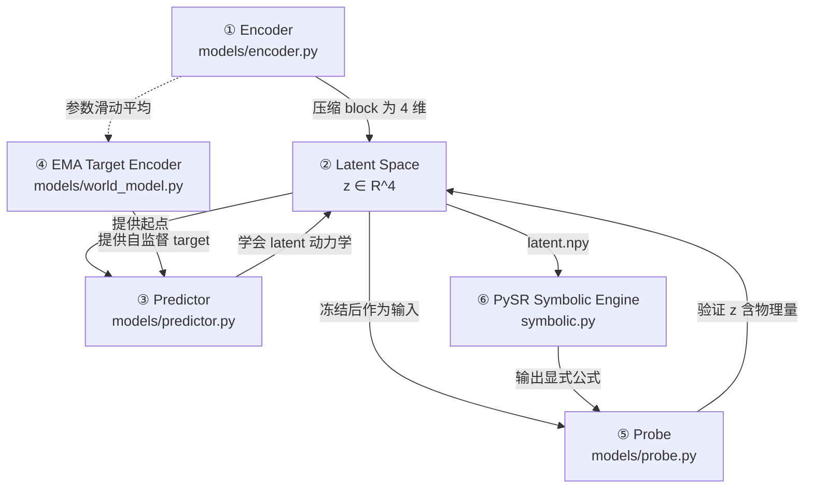
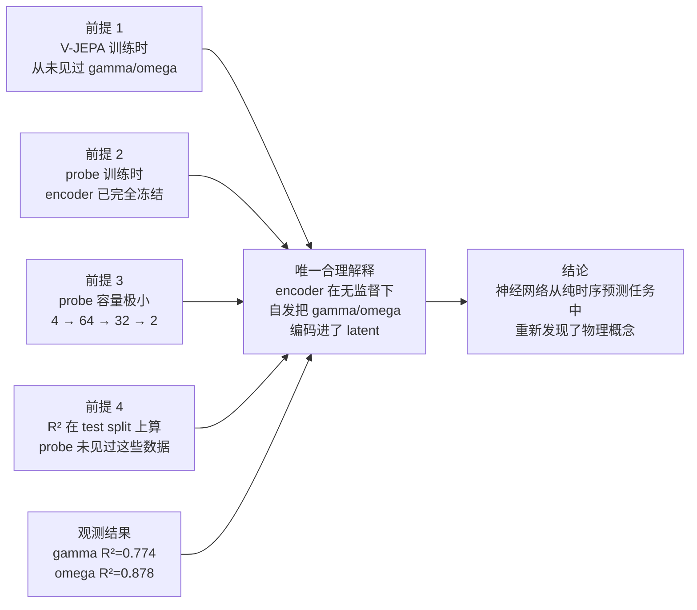
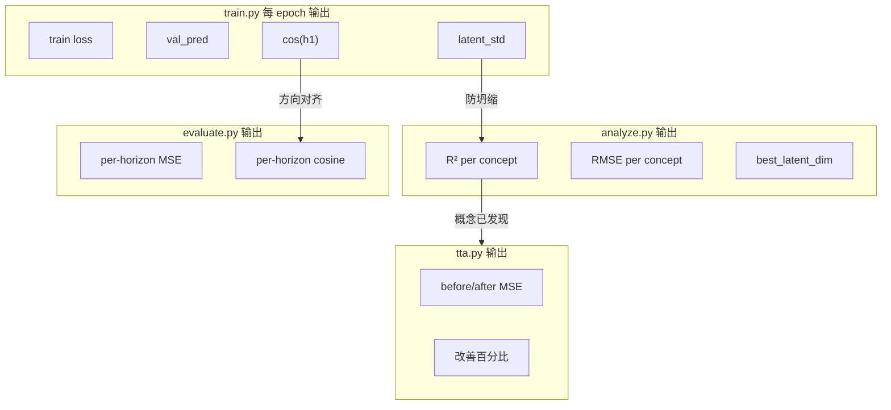
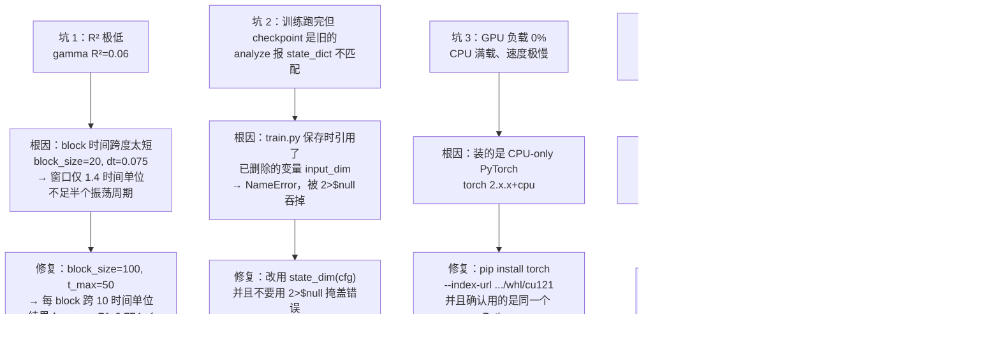

好问题。整个平台有**一条主线流程**和一个**一键脚本**。

## 运行顺序（主线）

```
train.py → analyze.py → symbolic.py → evaluate.py → tta.py
```

每一步都依赖上一步的输出：

| 步骤 | 脚本 | 做什么 | 输出 |
|---|---|---|---|
| 1 | `train.py` | V-JEPA 训练编码器+预测器 | `outputs/checkpoint.pt` |
| 2 | `analyze.py` | 冻结编码器，提取 latent，训练物理探针 | `outputs/latent.npy`, `labels.npy`, R² 报告 |
| 3 | `symbolic.py` | PySR 从 latent 发现公式（需装 Julia） | 公式表达式 |
| 4 | `evaluate.py` | 多步 latent 预测精度评估 | 每 horizon 的 MSE/cosine 表+图 |
| 5 | `tta.py` | AdaJEPA 无标签在线适应 | before/after 对比 |

## 最简用法

**一键跑完全流程：**

```powershell
python run_all.py --config configs/pendulum.yaml
```

这个脚本按上面的顺序依次执行，如果 PySR 没装会自动跳过 symbolic 阶段。

**或者手动逐步跑（推荐先用这个熟悉流程）：**

```powershell
# 第1步：训练（最耗时，GPU 上约 10-20 分钟）
python train.py --config configs/pendulum.yaml

# 第2步：概念发现（几秒）
python analyze.py --config configs/pendulum.yaml

# 第3步：公式发现（可选，需 PySR + Julia）
python symbolic.py --config configs/pendulum.yaml

# 第4步：多步预测评估（几秒）
python evaluate.py --config configs/pendulum.yaml

# 第5步：在线适应（几秒）
python tta.py --config configs/pendulum.yaml --noise-std 0.05
```

## 其他文件的作用

| 文件/目录 | 角色 | 需要手动运行？ |
|---|---|---|
| `configs/*.yaml` | 配置文件（唯一真相源） | ❌ 被各脚本读取 |
| `models/` | Encoder, Predictor, Probe, WorldModel | ❌ 被 import |
| `data/` | 数据生成器 + Dataset | ❌ 被 import |
| `utils/` | 损失函数、指标、绘图、种子 | ❌ 被 import |
| `test_data.py` | 数据生成器冒烟测试 | 仅调试时跑 |
| `requirements.txt` | 依赖列表 | `pip install -r requirements.txt` |

**总结：你只需要记住两个命令**——快速体验用 `python run_all.py`，精细控制用 `python train.py` 然后按需跑后续步骤。所有脚本都通过 `--config` 指定配置，同一个配置驱动全流程。

---

# 系统性归纳：SciNet++ 架构、训练机制与指标手册

## 一、总体流程图



**逻辑先后关系要点**：

| 依赖 | 说明 |
|---|---|
| 阶段 0 → 1 | 训练需要时序 blocks，**不需要**标签 |
| 阶段 1 → 2 | analyze 必须加载 checkpoint.pt，否则无 encoder 可用 |
| 阶段 2 → 3 | symbolic 必须读 analyze 产出的 latent.npy / labels.npy |
| 阶段 1 → 4 | evaluate 加载同一 checkpoint，复用 predictor 做滚动 |
| 阶段 4 → 5 | tta 逻辑上是 evaluate 的延伸：先测基线，再适应，再测 |
| 标签 G4 | **只流向 A4 和 Y1**（虚线），绝不进入训练损失 |

---

## 二、V-JEPA 内部结构图（阶段 1 展开）



### 为什么必须有 EMA target encoder？

如果 online 和 target 是**同一个** encoder（共享权重），模型会立刻发现一个作弊解：把所有输入都映射成同一个常数向量 c。此时 `MSE(pred, target) = 0`，损失完美，但 latent 毫无信息量——这就是**表示坍缩（representation collapse）**。

EMA target 打破这个作弊路径：target encoder 不接受梯度，它只是 online 的历史滑动平均。online encoder 无法「命令」target 配合自己坍缩，因为 target 的更新永远滞后且不受当前梯度直接控制。VICReg 的 variance 项再从正面施压：任何一维 std < 1.0 就罚，让常数解在数值上不可行。两者叠加才让 JEPA 能训起来。

---

## 三、每个模块：功能 / 训练方式 / 如何体现「理解物理」



| 模块 | 功能 | 怎么训练 | loss | 训练时看标签吗？ | 如何体现「理解物理」 |
|---|---|---|---|---|---|
| **① Encoder** | 把 100 步时序 block 压缩成 4 维 latent | 与 predictor 联合训练，Adam + 余弦退火 | pred_loss + VICReg | ❌ 完全不看 | 它必须在无监督下找出「能预测未来」的变量，而物理上唯一能预测未来的就是 gamma/omega |
| **② Latent Space** | 4 维概念空间 | —（encoder 的输出） | — | — | 若 z0 与 omega 强相关、z1 与 gamma 强相关 → 概念被**自动分离**到不同维度 |
| **③ Predictor** | latent 空间的转移函数 f，滚动 k 次预测未来 | 与 encoder 联合训练 | 同上 | ❌ | f^k(z) 逼近 z_{t+k} 说明它学到了**演化规律**，而非记忆固定映射 |
| **④ EMA Target Encoder** | 提供稳定的预测目标 | 不接受梯度，仅 `target ← m·target+(1-m)·online` | 无 | ❌ | 防坍缩的关键机制，保证 latent 不退化成常数 |
| **⑤ Probe** | 检验 z 里是否含 gamma/omega | 在**冻结** latent 上单独训练小 MLP | MSE(probe(z), y_true) | ✅ 这一步才用标签 | 小容量 MLP + 冻结 encoder → 高 R² 只能解释为「z 里本来就有」 |
| **⑥ PySR** | 把隐式知识变成显式公式 | 遗传编程（进化算法，非梯度下降） | Pareto：accuracy vs simplicity | ✅ | 输出人类可读的 `gamma ≈ f(z0..z3)`，完成 AI Feynman 闭环 |

> 上表是速览。下面是每个模块的详细展开。

#### ① Encoder（models/encoder.py）

**网络结构**（以默认 conv 为例）：
```
输入 x: (B, block_size × state_dim) = (B, 100×1) = (B, 100)
  ↓ reshape → (B, state_dim, block_size) = (B, 1, 100)
  ↓ Conv1d(1→64, kernel=5, stride=2) + ReLU + BatchNorm   → (B, 64, 48)
  ↓ Conv1d(64→128, kernel=5, stride=2) + ReLU + BatchNorm → (B, 128, 22)
  ↓ Conv1d(128→128, kernel=3, stride=2) + ReLU + BatchNorm→ (B, 128, 10)
  ↓ AdaptiveAvgPool1d(pool_k=2)                           → (B, 128, 2)
  ↓ flatten → (B, 256)
  ↓ Linear(256→64) + ReLU → Linear(64→latent_dim=4)
输出 z: (B, 4)
```
也支持 MLP（全连接）和 Transformer（自注意力 + 正弦位置编码），通过 config 中 `encoder_type: mlp|conv|transformer` 一行切换。三种架构保持相同的接口契约 `(B, block_dim) → (B, latent_dim)`，下游零修改。

**输入**：一个 block 的展平时序信号，shape `(B, block_size × state_dim)`。对 pendulum 是 `(B, 100)`——100 个时间步的标量位移 x(t)。

**输出**：latent 向量 z，shape `(B, 4)`。这 4 个数是 encoder 对这个 block 的「理解」。

**Loss**：Encoder 不单独有 loss，它与 Predictor 联合优化同一个目标：
```
L_total = pred_w · L_pred + var_w · L_var + cov_w · L_cov
```
梯度通过 `L_pred` 流回 encoder（因为 z_context = encoder(block_ctx)，predictor 的输入依赖 encoder 的输出）。三个分项的含义见下方「共享 Loss」。

**训练方式**：Adam 优化器 + CosineAnnealingLR 学习率调度。只更新 `requires_grad=True` 的参数（encoder + predictor），target encoder 被排除。

**为什么 conv 比 MLP/Transformer 更适合这个任务？**
- ω（局部频率）：卷积核天然做频率滤波，归纳偏置匹配周期信号
- γ（包络衰减）：AdaptiveAvgPool 保留全局趋势
- 平移等变性：Conv 内建，Transformer 需从数据学
- 参数效率：Conv 远少于 Transformer，在 GTX 1050 4GB 上 ~3s/epoch vs Transformer ~45s/epoch

#### ② Latent Space（z ∈ R⁴）

**不是独立模块**，而是 Encoder 的输出空间。但它值得单独讨论，因为它是整个平台的「概念载体」。

**维度选择**：`latent_dim=4` 对应阻尼振荡器的 4 个物理参数 (γ, ω, A, φ)。设为 3 时 R² 明显下降（信息不够），设为 5+ 时多出的维度与任何概念都不相关（冗余）。

**VICReg 如何塑造 latent 空间？**
- **variance_loss**：推每维 std → 1.0。防止所有样本挤到同一点（坍缩）
- **covariance_loss**：惩罚维度间相关性。迫使 z0, z1, z2, z3 各自携带独立信息
- 两者叠加的效果：4 个维度自动分配到 4 个独立的物理量上，而不是冗余编码同一个

**实际观测**：omega→z0（Pearson |r|≈0.93）、gamma→z1（|r|≈0.88），A 和 φ 大概率占据 z2/z3。VICReg 成功实现了概念分离。

#### ③ Predictor（models/predictor.py）

**网络结构**（默认 MLP）：
```
输入 z: (B, latent_dim) = (B, 4)
  ↓ Linear(4→256) + ReLU
  ↓ Linear(256→256) + ReLU
  ↓ Linear(256→4)
输出 z': (B, 4)
```
也支持 Transformer（单 token 自注意力 + LayerNorm），通过 `predictor_type: mlp|transformer` 切换。但单 token 自注意力退化为恒等映射，功能上等价于 MLP+LayerNorm，实测无收益。

**输入**：当前时刻的 latent z_b，shape `(B, 4)`

**输出**：下一时刻的预测 latent z'_{b+1}，shape `(B, 4)`

**关键设计：同一个 predictor 反复应用 k 次**。在 `world_model.py:82-97` 中：
```python
z = z0
for step in range(1, max(horizons) + 1):
    z = self.predictor(z)       # 同一个 f 反复应用
    if step in horizons:
        preds[step] = z
```
这意味着 predictor 学到的是**转移函数** f: z_t → z_{t+1}，而不是每个 horizon 一个独立的映射。如果 f^4(z) 仍然准确，说明模型真正学到了 latent 空间的动力学规律。

**Loss**：与 Encoder 共享同一个 `L_total`。梯度从 `L_pred = mean_k MSE(f^k(z_ctx), target_encoder(block_{ctx+k}))` 流回 predictor。

#### ④ EMA Target Encoder（models/world_model.py）

**网络结构**：与 Online Encoder **完全相同**（`copy.deepcopy`），但不接受梯度。

**输入/输出**：与 Online Encoder 相同，`(B, block_dim) → (B, latent_dim)`。但它编码的是**未来 block**（block_{ctx+k}），提供预测目标。

**没有 Loss，只有参数更新规则**：
```
θ_target ← m · θ_target + (1 - m) · θ_online
```
其中 momentum m 通过余弦退火从 base_momentum（如 0.99）逐渐升到 ~1.0：
```
m(step) = 1 - (1 - base) × (cos(π × step/warmup_steps) + 1) / 2
```
初期 m 低 → target 紧跟 online，两者差异小，训练稳定；后期 m→1 → target 几乎冻结，提供稳定的预测目标。

**为什么必须有它？** 如果 online 和 target 共享权重，模型会找到作弊解：把所有输入映射到同一个常数 c，此时 MSE(pred, target)=0，loss 完美但 latent 毫无信息——这就是**表示坍缩**。EMA target 打破这条路径：它不受当前梯度直接控制，online 无法「命令」它配合坍缩。

#### ⑤ Probe（models/probe.py）

**网络结构**：
```
输入 z: (B, latent_dim) = (B, 4)
  ↓ Linear(4→64) + ReLU
  ↓ Linear(64→32) + ReLU
  ↓ Linear(32→out_dim)      # pendulum: out_dim=2 (gamma, omega)
输出 ŷ: (B, 2)
```
hiddens 由 config `probe.hidden: [64, 32]` 决定。**故意设得很小**——这是实验设计的关键：如果 z 里没有 gamma 的信息，这个小网络不可能凭空恢复它。

**输入**：冻结的 V-JEPA latent z，shape `(B, 4)`。Encoder 在此阶段 `requires_grad_(False)`，完全不更新。

**输出**：物理概念预测值 `(gamma_hat, omega_hat)`，shape `(B, 2)`。

**Loss**：
```
L_probe = MSE(probe(z), y_true)
      = (1/B) Σ_i || probe(z_i) - y_i ||²
```
其中 y_i 是 ground-truth (gamma, omega)，来自数据生成时的随机采样。**这是整个平台中唯一使用标签的地方**。

**训练方式**：单独的 Adam 优化器，epochs 和 lr 由 config 控制。目标先标准化（用 train split 的均值/标准差），预测后反标准化再算 R²/RMSE。

**为什么高 R² 证明概念被发现？** 三层保障：
1. Encoder 冻结 → probe 不能反向修改 encoder 来「塞入」信息
2. Probe 容量极小 → 无法从随机噪声中拟合出非线性关系
3. Test split 评估 → 排除过拟合

三者叠加，R²=0.774 的唯一合理解释是：encoder 在无监督训练中已经把 gamma 编码进了 z。

#### ⑥ PySR Symbolic Engine（symbolic.py）

**不是神经网络，没有可训练权重。** PySR 是基于遗传编程（Genetic Programming）的符号回归引擎。

**输入**：latent 维度作为特征变量。PySR 看到的是 N 个样本 × 4 个特征 (z₀,z₁,z₂,z₃)，以及对应的 ground-truth concept 值（如 gamma）。

**输出**：人类可读的数学表达式，如：
```
gamma ≈ 0.280 - ((x₁ * -0.051) - (cos((-0.162 * x₃) + (0.748 * x₂)) * 0.053))
```
其中 x₁..x₄ 对应 z₀..z₃。

**「训练」方式（进化算法，非梯度下降）**：
1. **初始化**：随机生成一批表达式树（如 `z₁ + cos(z₀)`、`exp(z₂) * z₃`）
2. **评估**：对每个表达式计算 MSE(predicted_concept, true_concept)
3. **选择**：保留 Pareto 前沿上的候选（accuracy vs simplicity 的权衡）
4. **变异/交叉**：对存活的表达式树做随机修改（替换运算符、交换子树、插入节点）
5. **迭代**：重复 40 代（`niterations=40`），每代尝试新的组合

**允许的运算符**由 config 指定：`binary_operators: ["+", "-", "*"]`，`unary_operators: ["exp", "cos"]`。

**Pareto Score**：PySR 不只追求最低 MSE，而是在 (accuracy, simplicity) 二维空间中找最优前沿。一个稍复杂但精度大幅提升的公式会比一个简单但粗糙的公式得分更高。最终输出的「best equation」是 score 最高的候选。

**与 Probe 的关系**：Probe 验证了「z 里有 gamma」（R²=0.774），PySR 进一步把这种隐式关系变成**显式公式**。Probe 回答「有没有」，PySR 回答「具体是什么」。

#### 共享 Loss 详解（utils/losses.py）

Encoder 和 Predictor 联合优化的总损失：
```
L_total = pred_w · L_pred + var_w · L_var + cov_w · L_cov
```

**L_pred（预测损失）**：
```
L_pred = (1/K) Σ_{k∈horizons} MSE(f^k(z_context), target_encoder(block_{context+k}))
```
对所有 horizon 取平均，使短期和长期预测贡献相等。这是驱动 encoder 和 predictor 学习的主信号。

**L_var（方差损失，VICReg variance term）**：
```
L_var = mean_j( relu(target_std - std_j(z)) )
```
对每个 latent 维度 j，如果跨 batch 的 std < target_std（默认 1.0），就施加线性惩罚。这是一个 **hinge loss**：std ≥ 1.0 时 loss=0，std < 1.0 时 loss 正比于差距。防止所有样本映射到同一点（坍缩）。

**L_cov（协方差损失，VICReg covariance term）**：
```
cov_matrix = (Z_centered^T @ Z_centered) / (N-1)     # (d×d) 样本协方差矩阵
L_cov = Σ_{i≠j} cov_matrix[i,j]² / d                  # 对角线以外的平方和取均值
```
惩罚 latent 维度之间的相关性。如果 z₀ 和 z₁ 高度相关，说明它们在冗余编码同一信息。最小化 L_cov 迫使每个维度捕获独立的概念——这正是 gamma 和 omega 被分配到不同维度的原因。

**典型权重**（pendulum.yaml）：`pred_weight=1.0, vicreg_var_weight=1.0, vicreg_cov_weight=0.04`。协方差项权重较小是因为它的数值量级比方差项大得多。


### 「神经网络理解物理公式」的完整论证链



**反证思路**：假设 z 里不含 gamma 信息（只是 4 个与物理无关的随机数）。那么任何 probe，无论多大，都不可能从 z 预测出 gamma——因为信息根本不存在。R²=0.774 意味着 probe 解释了 gamma 方差的 77.4%，这在信息论上要求 z 携带 gamma 的信息量。而这个信息只可能来自 encoder 在自监督训练中自己学到，因为它没有别的来源。

---

## 四、指标手册：公式 / 意义 / 健康范围 / 举例

### 4.1 指标总览（哪个阶段产出哪个指标）



### 4.2 逐个指标详解

#### ① `train`——总训练损失

**源码**：`train.py:155` → `loss = pred_weight * pred_l + vic_l`

**公式**：
```
train = pred_w · mean_k MSE(z_pred_k, z_target_k) + var_w · VarLoss(z) + cov_w · CovLoss(z)
```

**意义**：整体优化目标。包含预测项 + 两项防坍缩正则。

**健康范围**：单调下降至收敛。你的结果 6.79 → 0.010 ✅

**注意**：初期很大（~6.8）是因为随机 encoder 的 latent 方差远低于 1.0，variance hinge 惩罚极大。这是正常现象，不是 bug。

---

#### ② `val_pred`——验证集纯预测 MSE

**源码**：`train.py:222-224` 调用 → `utils/losses.py:43-50` 计算 → `train.py:235` 汇总

**公式**：
```
val_pred = mean_over_batches( mean_over_horizons( MSE(z_pred_k, z_target_k) ) )
```

**意义**：**不含 VICReg**，是纯预测质量。比 train loss 更干净地反映模型好不好。

**健康范围**：~0.001 - 0.01

**注意（关键陷阱）**：epoch 0 的 val_pred 常常是 0.0000，这**不是完美预测**，而是假象。原因：训练刚开始时 EMA target encoder 与 online encoder 几乎完全相同（momentum 还低），而随机 encoder 输出的 latent 方差极小且近似，两者差异自然接近 0。随训练推进 EMA 拉开差距，val_pred 升到真实水平（~0.008）并稳定。

**判断过拟合的信号**：train loss 持续下降但 val_pred 持续上升。你的结果最终稳定在 0.008 → 无过拟合 ✅

---

#### ③ `latent_std`——坍缩诊断器

**源码**：`train.py:176` → `utils/metrics.py:97-108`

**公式**：
```
latent_std = mean_j( std_i(z_ij) )
其中 i 遍历所有样本，j 遍历 latent 维度
```
即：先算每个 latent 维度跨样本的标准差，再对所有维度取均值。

**意义**：VICReg 的目标是让每维 std ≈ 1.0。这是监控**表示坍缩**的唯一直接手段。

**健康范围**：

| 值 | 含义 |
|---|---|
| ~0.0 | ❌ **完全坍缩**，所有输入映射到同一点，信息全丢 |
| < 0.3 | ⚠️ 坍缩危险，概念不可能被发现 |
| 0.8 - 1.5 | ✅ 健康 |
| > 3.0 | ⚠️ 方差过大，可能训练不稳定 |

**举例**：假设一个 batch 有 3 个样本，latent_dim=4：
```
         z0     z1     z2     z3
样本1   0.8    1.2   -0.3    0.5
样本2   0.3    0.8    0.1   -0.2
样本3  -0.1    0.3    0.5    0.9

std(z0)=0.45, std(z1)=0.45, std(z2)=0.40, std(z3)=0.55
latent_std = mean(0.45,0.45,0.40,0.55) = 0.46  ⚠️ 偏低
```
若三个样本的 z 全是 `[0.5, 0.5, 0.5, 0.5]` → std 全为 0 → latent_std=0 → 完全坍缩。

你的结果 1.04 → 1.13，全程健康 ✅

---

#### ④ `cos(h1)`——1 步方向对齐度

**源码**：`train.py:227-229` → `utils/metrics.py:71-94`

**公式**：
```
cos(h1) = mean_samples( (z_pred_1 · z_target_1) / (|z_pred_1| × |z_target_1|) )
```

**h1 = horizon 1**：从 context block 出发，predictor 滚 **1 步**预测下一个 block 的 latent。

**为什么 cosine 比 MSE 更鲁棒？** 举例，设 target = `[1.0, 0.0]`：

| 预测值 | MSE | Cosine | 真实质量 |
|---|---|---|---|
| `[0.9, 0.1]` | 0.01 | 0.995 | ✅ 方向对、幅度对 |
| `[2.0, 0.0]` | **1.00** | **1.000** | ⚠️ 方向完全正确，只是尺度偏大 |
| `[0.0, 1.0]` | **1.00** | **0.000** | ❌ 幅度一样但方向完全错 |

MSE 把后两种都判为 1.0（同样差），但实际上第二种远好于第三种。VICReg 只推 std≈1，不精确锁定尺度，所以 latent 全局尺度会在 0.8-1.3 浮动，MSE 会被这个浮动干扰。**cosine 完全忽略尺度**，只回答一个问题：predictor 指向了正确的方向吗？

**健康范围**：

| 值 | 含义 |
|---|---|
| > 0.95 | ✅ 优秀 |
| 0.85 - 0.95 | ⚠️ 可用但有改进空间 |
| < 0.5 | ❌ 预测器未学到动力学 |

你的结果 0.967 → 0.985 ✅

---

#### ⑤ `R²`——决定系数（概念发现的核心证据）

**源码**：`analyze.py:145` → `utils/metrics.py:41-68`

**公式**：
```
R² = 1 - SS_res / SS_tot
SS_res = Σ(y_true - y_pred)²      残差平方和
SS_tot = Σ(y_true - ȳ_true)²      ground truth 总方差
```

**四个变量的含义**（最容易混淆的地方）：

| 符号 | 含义 | 来源 |
|---|---|---|
| `y_true` | 真值 gamma / omega | 数据生成时 `np.random.uniform` 采样，存于 labels.npy |
| `y_pred` | probe 预测值 | probe(z) 输出，已反标准化回原单位 |
| `ȳ_true` | y_true 的均值 | 一个标量，代表「最蠢的 baseline」 |
| `z` | 冻结 latent | encoder(block_0) |

**直觉理解**：
- 分母 = 「如果你什么都不学，只预测均值，误差多大」
- 分子 = 「probe 的实际误差多大」
- R² = 「probe 比预测均值好了多少比例」

**完整举例**（gamma，5 个测试样本）：
```
样本   y_true   y_pred   y_true-y_pred   y_true-ȳ_true
───────────────────────────────────────────────
 1      0.05     0.06       -0.01          -0.10
 2      0.10     0.11       -0.01          -0.05
 3      0.15     0.14       +0.01           0.00
 4      0.20     0.22       -0.02          +0.05
 5      0.25     0.24       +0.01          +0.10
                          ȳ_true = 0.15

SS_res = 0.0001+0.0001+0.0001+0.0004+0.0001 = 0.0008
SS_tot = 0.0100+0.0025+0.0000+0.0025+0.0100 = 0.0250

R² = 1 - 0.0008/0.0250 = 1 - 0.032 = 0.968
```

**健康范围**：

| 值 | 含义 |
|---|---|
| > 0.9 | ✅✅ 概念被强发现 |
| 0.5 - 0.9 | ✅ 概念被发现（你的 gamma=0.774 在此区间） |
| 0.1 - 0.5 | ⚠️ 部分编码，需改进 |
| ≤ 0 | ❌ **未发现**，比预测均值还差 |

**注意（本项目踩过的最大坑）**：R² 极低（~0.06）时，先不要怀疑 encoder 架构，而要先检查 **block 的时间跨度**。因为 analyze.py 只编码 block 0，若 block_size×dt 只有 1.4 个时间单位，则窗口内不足半个振荡周期、衰减可忽略 → gamma/omega 在信息论上就**不可辨识**，换任何 encoder 都无效。修复：block_size=100, dt≈0.1 → 每 block 跨 10 个时间单位，R² 升到 0.59/0.82。

---

#### ⑥ `RMSE`——均方根误差

**源码**：`analyze.py:151` → `utils/metrics.py:32-38`

**公式**：
```
RMSE = sqrt( (1/N) Σ(y_true - y_pred)² ) = sqrt(MSE)
```

**意义**：与原始数据**同单位**的平均误差幅度。R² 是相对指标，RMSE 是绝对指标。

**注意：R² 高但 RMSE 也大的情形完全正常。** 你的 omega：R²=0.878（相对精度高）但 RMSE=0.1518（绝对误差大）。原因是 omega 范围 [0.5, 2.0] 跨度 1.5，而 gamma 范围 [0.01, 0.3] 跨度仅 0.29。判断误差大小时必须除以量程：

```
gamma: RMSE/量程 = 0.0404 / 0.29 = 13.9%
omega: RMSE/量程 = 0.1518 / 1.50 = 10.1%   ← omega 实际上更精确
```

---

#### ⑦ `best_latent_dim`——概念定位

**源码**：`analyze.py:69-78`

**公式**：
```
corr_j = Pearson(z_j, y) = Σ(z_j标准化 · y标准化) / N
best_dim = argmax_j |corr_j|
```

**意义**：告诉你哪个 latent 维度「承载」了这个物理概念。这是 SciNet 主张「概念自动分离」的直接证据。

**举例**（5 样本，4 维 latent，concept = gamma）：
```
样本   z0     z1     z2     z3     gamma
───────────────────────────────────────
 1    0.8    1.2   -0.3    0.5     0.05
 2    0.3    0.8    0.1   -0.2     0.10
 3   -0.1    0.3    0.5    0.9     0.15
 4   -0.5   -0.2    0.8    1.1     0.20
 5   -0.9   -0.7    1.2    1.5     0.25

计算 Pearson：
corr(z0, gamma) = -0.97   ← |corr| 最大
corr(z1, gamma) = -0.95
corr(z2, gamma) = +0.88
corr(z3, gamma) = +0.72

→ best_latent_dim = z0
```

**注意：取的是绝对值**，所以负相关也算「强相关」。z0 与 gamma 呈 -0.97 的负相关，意味着 z0 越大 gamma 越小——信息量一样丰富，只是方向相反。probe 会自动学到这个负号。

你的实际结果：omega→z0、gamma→z1，**两个物理量被分配到了不同维度**，这正是 VICReg covariance 惩罚项的作用效果。

---

#### ⑧ per-horizon MSE / cosine——多步预测质量

**源码**：`evaluate.py:47-85`

**公式**：对每个 horizon k ∈ {1,2,3,4}
```
MSE_k    = mean_batches( mean( (f^k(z_ctx) - target_encoder(block_k))² ) )
cosine_k = mean_batches( mean_samples( cos(f^k(z_ctx), target_encoder(block_k)) ) )
```

**horizon 的含义**（关键概念）：数据被切成 5 个 block，从 block_0 出发：
```
[block_0 | block_1 | block_2 | block_3 | block_4]
    ↑ context
    │
    ├─ horizon=1 → 滚 1 步，预测 block_1 的 latent
    ├─ horizon=2 → 滚 2 步，预测 block_2 的 latent
    ├─ horizon=3 → 滚 3 步，预测 block_3
    └─ horizon=4 → 滚 4 步，预测 block_4
```
**关键**：`world_model.py:82-97` 中滚 k 步用的是**同一个** predictor 反复应用 k 次，而非每个 horizon 一个独立网络。这才是真正的「学到转移函数」。

**你的结果**：
```
horizon |   MSE    | cosine
   1    | 0.00782  | 0.9845
   2    | 0.01176  | 0.9697
   3    | 0.00809  | 0.9779
   4    | 0.00519  | 0.9841
```

**注意事项**：MSE 随 horizon **不一定单调上升**。你的 h2 最大（0.0118）、h4 反而最小（0.0052）。这不是 bug，原因是：训练时 context block 是**随机采样**的（`train.py:143`），而评估时固定在 block 0。不同 block 位置的物理状态不同（block_4 时振幅已衰减得很小，latent 更接近原点，MSE 自然更小）。**跨 horizon 比较应优先看 cosine**，它尺度无关：0.9697-0.9845 全程高位，说明滚 4 步方向仍准。

---

#### ⑨ TTA 改善百分比

**源码**：`tta.py:148-152`

**公式**：
```
delta = 100% × (mean_MSE_before - mean_MSE_after) / mean_MSE_before
```

**意义**：**零标签**情况下的自我改进幅度。这是 AdaJEPA 的核心价值证明。

**为什么不用标签也能适应？** 因为 JEPA 的训练目标本身就不需要标签：predict future latent + VICReg，target 由 EMA encoder 提供（自监督参考）。所以同一个目标可以在部署时继续用。

**你的结果**：+13.54%（0.00905 → 0.00782），25 步梯度下降，零标签 ✅

**注意事项**：
- 默认只适应 **predictor**，encoder 保持冻结。这是故意的：避免破坏已学到的表示
- VICReg 必须在 TTA 中保留，否则几十步梯度下降足以让 latent 坍缩
- 若 `adapt_encoder=True`，必须同时更新 EMA target（`tta.py:128-129`），否则 target 会逐渐过时
- 改善幅度通常 5%-20%。若出现**负改善**，先检查 lr 是否过大、steps 是否过多

---

### 4.3 指标速查表

| 指标 | 阶段 | 源码位置 | 公式核心 | 健康值 | 看什么 |
|---|---|---|---|---|---|
| `train` | train | losses.py:27-86 | pred_MSE + VICReg | 单调下降 | 是否收敛 |
| `val_pred` | train | train.py:222-235 | mean_k MSE | 0.001-0.01 | 是否过拟合 |
| `latent_std` | train | metrics.py:97 | mean_j std_i(z_ij) | 0.8-1.5 | **是否坍缩** |
| `cos(h1)` | train | metrics.py:71 | 余弦均值 | >0.95 | 方向对齐 |
| `R²` | analyze | metrics.py:41 | 1 - SS_res/SS_tot | >0.5 | **概念是否发现** |
| `RMSE` | analyze | metrics.py:32 | sqrt(MSE) | 除以量程看 | 绝对精度 |
| `best_dim` | analyze | analyze.py:69 | argmax\|Pearson\| | — | 概念在哪个维度 |
| `MSE_k` | evaluate | evaluate.py:60 | 每 horizon MSE | <0.02 | 多步精度 |
| `cosine_k` | evaluate | evaluate.py:61 | 每 horizon 余弦 | >0.95 | **多步方向对齐** |
| `TTA delta` | tta | tta.py:150 | 相对改善% | +5%~+20% | 无标签适应力 |

---

## 五、注意事项与已踩过的坑



### 关键工程原则

1. **先验证可辨识性，再优化架构**。用经典估计器（FFT 峰值估 omega、对数包络斜率估 gamma）在原始信号上跑一遍 R²，得到理论上限。若经典方法都估不出，神经网络也不可能估出——问题在数据，不在模型。

2. **标签绝不进入训练损失**。检查方法：搜索 train.py 中是否引用 `batch["labels"]`。本项目 train.py 只取 `batch["blocks"]` ✅

3. **encoder 必须在 probe 训练前冻结**。`analyze.py:117-118` 的 `requires_grad_(False)` 是论证有效性的前提，删掉则整个 SciNet 论证失效。

4. **不要在 PowerShell 里用 `2>$null`**。它会吞掉所有错误，让失败看起来像成功（坑 2 就是这么发生的）。

5. **配置是唯一真相源**。所有维度（block_size, latent_dim, hidden, rollout）都从 YAML 读，代码里不写死数字，否则改配置会静默失效。

---

## 六、终极形态：Neuro-Symbolic AI——神经网络与符号推理的融合

既然神经网络（NN）和遗传编程（GP）各有优劣，当前 AI 领域最前沿的研究方向正是将两者结合——这也是 SciNet++ 平台天然支持的架构。

### 6.1 NN 做特征提取 + GP 做公式发现

这正是 SciNet++ 当前的管线设计：

```
原始高维时序 → [Encoder (NN)] → 低维 Latent Embedding (z₀..z₃) → [PySR (GP)] → 可解释数学公式
```

| 环节 | 角色 | 解决的问题 |
|---|---|---|
| **Encoder (NN)** | 把 100 步时序压缩成 4 维 latent | GP 直接在高维原始数据上搜索会遭遇**维度灾难**——搜索空间随维度指数爆炸。NN 先降维到富含语义的低维表示，让 GP 的搜索变得可行 |
| **PySR (GP)** | 在 latent 上搜索显式公式 | NN 是黑盒，无法给出人类可读的表达式。GP 输出 `gamma ≈ f(z₀,z₁,z₂,z₃)` 这样的符号公式，赋予整个系统**可解释性** |

这就是 Neuro-Symbolic 的核心思想：**NN 负责「感知」（从高维数据中提取结构化表示），GP 负责「推理」（从表示中发现可解释的规律）**。两者互补，缺一不可。

SciNet++ 的 `train.py → analyze.py → symbolic.py` 管线就是这个范式的完整实现。

### 6.2 LLM 指导 GP 进化（LLM-guided GP）

传统 GP 的变异操作是**盲目的**：随机把 `+` 变成 `*`、随机替换子树、随机插入节点。这种无方向的搜索效率很低，容易陷入局部最优。

前沿做法是引入大语言模型（LLM）作为**启发式导师**：


具体工作方式：

1. **当 GP 陷入停滞时**（连续多代 Pareto 前沿无改善），将当前最优公式树、误差分布、以及领域知识（如「这是阻尼振荡器」「能量应该守恒」）作为 prompt 发给 LLM
2. **LLM 提出有逻辑的变异建议**：例如「当前公式缺少衰减项，尝试引入 exp(-x₂)」或「cos 的参数应该是线性组合而非单一变量」
3. **GP 采纳建议生成新候选**，比盲目随机变异更可能跳出局部最优
4. **效果**：文献报告搜索效率提升 2-10 倍，尤其在物理公式发现任务上

### 6.3 SciNet++ 如何对接这个前沿方向

当前平台的 `symbolic.py` 调用 PySR 时已经预留了扩展接口：

- **NN+GP 融合**：已经是现状。Encoder 产出的 latent 直接喂给 PySR，无需任何修改
- **LLM-guided GP**：PySR 本身支持自定义 `warmup_maxsize_by_iter` 和回调函数。可以在 `discover_formula` 中加入 LLM 调用，在每代结束后分析当前 Pareto 前沿，动态调整下一代的运算符权重或注入先验约束
- **更深层的融合**：未来可以让 LLM 直接参与 encoder 的设计（例如根据领域知识建议归纳偏置），或者让 GP 发现的公式反过来指导 encoder 的训练（公式作为正则化项）

这些扩展都不需要改变现有管线的核心结构——SciNet++ 的模块化设计天然支持 Neuro-Symbolic 的渐进式演进。
