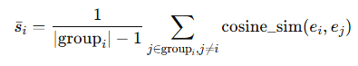
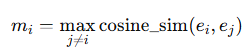
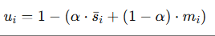
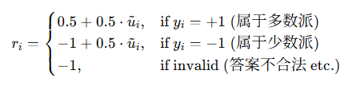

* 论文标题：
  Evolving Language Models without Labels:
  Majority Drives Selection, Novelty Promotes Variation
* 论文链接：
  https://arxiv.org/pdf/2509.15194
* 项目地址：
  https://github.com/YujunZhou/EVOL-RL

## 1. 问题背景：无标注训练＋“多数信号”会带来什么坏处

* 当一个语言模型想自己提升、但没有标签（即没有人工标注“对”“错”）也没有外部判别器时，通常会用一些“模型自身生成”的信号，比如让模型自己多次生成、然后取“大家都这样说”的答案作为“伪标签”或“可信答案”，再以此强化训练。论文把这种方法称为类似于“重复多数／一致性”机制（例如：多数投票、置信度最大化、自一致性等） 。 ([arXiv](https://arxiv.org/abs/2509.15194?utm_source=chatgpt.com "Evolving Language Models without Labels: Majority Drives ..."))
* 这种机制看起来似乎合理：“大家都这么说，应该没错” → 用这个作为训练依据。但作者发现：如果仅靠“多数”或“一致”作为信号，就容易导致  **探索能力下降** 、 **模型输出变得更短、更雷同** 、 **思考链（reasoning chain）变浅** 。在强化学习术语里，他们称这种现象为  **熵崩溃（entropy collapse）** 。 ([arXiv](https://arxiv.org/pdf/2509.15194?utm_source=chatgpt.com "Majority Drives Selection, Novelty Promotes Variation"))
* 举个比喻：假如一个班上大家都在做题，老师让大家先自己想再比答案。如果每次都选择“最多人选的答案”然后大家都学这个套路，慢慢每个人都会走同一套路——思考深度降低、新思路少了、反而越练越“单一”。于是模型虽然稳定了，但在未见过的新题／不同领域上就弱了。
* 实际上，论文中的实验发现：在纯“多数＝正确”训练下，模型的 pass@1（只取第一个答案的正确率）可能上去一点，但 pass@n（多次尝试／多样答案取正确率）反而下降，输出链条变短、熵值下降。 ([arXiv](https://arxiv.org/html/2509.15194v1?utm_source=chatgpt.com "Evolving Language Models without Labels: Majority Drives ..."))
* 对你的场景而言：如果你使用模型在没有人工标注的环境、自我训练、自我生成数据，那你就很可能碰到这个“模型越来越保守、越来越少探索”的问题，这会限制模型的泛化能力。

---

## 2. 方法概览：借鉴“进化”机制 — 稳定（选择）＋变异（探索）

论文提出的方法叫  **EVOL‑RL** （Evolution-Oriented and Label-free Reinforcement Learning）。 ([arXiv](https://arxiv.org/html/2509.15194v1?utm_source=chatgpt.com "Evolving Language Models without Labels: Majority Drives ..."))

核心思想就是：模仿生物进化中的两个关键力量——“选择（selection）”和“变异／探索（variation）”：

* **选择 (Selection)** ：保留“多数投票”的答案，作为一个稳定的锚点（anchor）。也就是：当模型多次对一个 prompting 生成多个回应时，先找出“最多人选的”答案，把它当作稳定信号。 ([arXiv](https://arxiv.org/pdf/2509.15194?utm_source=chatgpt.com "Majority Drives Selection, Novelty Promotes Variation"))
* **变异／新颖 (Variation / Novelty)** ：同时，不仅仅把“多数”当做唯一信号，而是给那些在“推理路径”“语义空间”里与其他生成不同的答案 **额外奖励** 。也就是说，鼓励模型生成“虽然不是最多人选的，但思路不同”的回应，从而保持探索、多样性。 ([arXiv](https://arxiv.org/pdf/2509.15194?utm_source=chatgpt.com "Majority Drives Selection, Novelty Promotes Variation"))
* 二者结合： **“多数投票提供稳定性” + “新颖性提供探索”** 。这样一方面防止模型乱飞、答案无规律（完全探索没稳定性），另一方面也防止模型陷入单一路径、思考变浅（完全多数就收敛了）——维持一种平衡。 ([arXiv](https://arxiv.org/html/2509.15194v1?utm_source=chatgpt.com "Evolving Language Models without Labels: Majority Drives ..."))
* 在技术上，他们是在无标签情形下，对模型生成进行强化学习 (RL) 的训练：模型生成多条回应 → 用“多数答案 + 新颖奖励”生成伪奖励 → 用类似 PPO/GRPO 类算法更新模型。 ([arXiv](https://arxiv.org/pdf/2509.15194?utm_source=chatgpt.com "Majority Drives Selection, Novelty Promotes Variation"))

---

## 3. 关键机制：怎么具体操作、哪些设计很重要

### 3.1 多次生成 + 多数投票

* 给定一个输入（如一个数学题） → 模型生成 **多条**输出（roll‐outs）。例如生成 16 条不同答案。 ([arXiv](https://arxiv.org/pdf/2509.15194?utm_source=chatgpt.com "Majority Drives Selection, Novelty Promotes Variation"))
* 在这多条输出里，看最终答案（可能分类／数值／结果）哪一个出现得最多（多数派） → 把这一多数派作为“稳定”伪标签／参考。 ([arXiv](https://arxiv.org/pdf/2509.15194?utm_source=chatgpt.com "Majority Drives Selection, Novelty Promotes Variation"))
* 这种多数派机制就是传统的“同伴协作”“一致性”思路。

### 3.2 新颖性奖励（Novelty Reward）

* 但不只是“选最多人选的”，还看 **每条生成的“推理路径”（reasoning trace）在语义空间里跟其他生成有多不同** 。通俗地说：“我这条回答虽然可能有人选，但如果我用了一条不一样的思考路线，那就加分”。
* 具体做法：先对每条生成的“推理部分”提取 embedding（语义表示） → 计算它和同批其他生成的平均相似度（intra‐group） + 最大相似度（to any other) → 得到一个 novelty 得分：novelty = 1 − [α * mean_similarity + (1−α) * max_similarity]。 ([arXiv](https://arxiv.org/pdf/2509.15194?utm_source=chatgpt.com "Majority Drives Selection, Novelty Promotes Variation"))
* 然后对多数群和少数群分别做 min-max 归一化，这样 novelty 得分在群体内部可比。 ([arXiv](https://arxiv.org/pdf/2509.15194?utm_source=chatgpt.com "Majority Drives Selection, Novelty Promotes Variation"))
* 最后，奖励设计：
  * 如果该回答属于多数派（yi = +1），那么 reward = 0.5 + 0.5 * normalized_novelty (范围 0.5~1)
  * 如果属于少数派（yi = −1），则 reward = −1 + 0.5 * normalized_novelty (范围 −1~−0.5) ([arXiv](https://arxiv.org/pdf/2509.15194?utm_source=chatgpt.com "Majority Drives Selection, Novelty Promotes Variation"))
* 翻译一下：多数派的回答给正奖励，而且越“新颖”越大；少数派的回答默认是惩罚（因为少数可能是错的或偏的），但如果它非常“新颖”，惩罚会稍微轻一点。

### 3.3 辅助机制：熵正则 + 非对称裁剪

* **熵正则（Entropy regularizer）** ：在策略更新里加入“鼓励输出多样性”的项，防止模型输出太快集中、变得单一。 ([arXiv](https://arxiv.org/pdf/2509.15194?utm_source=chatgpt.com "Majority Drives Selection, Novelty Promotes Variation"))
* **非对称裁剪 (Asymmetric clipping)** ：在策略优化（类似 PPO 的 surrogate objective）里，通常裁剪变化幅度。但他们把“上界”（ClipHigh）设置得比传统更高，允许那些 reward 很高、很“新颖”的生成有更强的学习信号。也就是说，允许“好的、但不常见”的生成被强化得更大。 ([arXiv](https://arxiv.org/pdf/2509.15194?utm_source=chatgpt.com "Majority Drives Selection, Novelty Promotes Variation"))

---

## 4. 为什么这样就能提升性能？背后的直观原因

* **防止模式锁定／保持多样性** ：如果只用多数投票，那模型会越来越相信“大家都这么做”的那条路径，慢慢变成“套路化”的答案，思考链短、多样性差。加入新颖性奖励后，模型还有动力去尝试“别人没走的路径”，从而保持思考链更长、输出更丰富。论文中也展示了模型在 EVOL-RL 下平均输出长度更长、策略熵（表示多样性）更高。 ([arXiv](https://arxiv.org/pdf/2509.15194?utm_source=chatgpt.com "Majority Drives Selection, Novelty Promotes Variation"))
* **稳定＋探索两手抓** ：“多数投票”提供一个可靠的参考，不至于让模型疯狂走偏；“新颖奖励”提供探索，不至于让模型停止尝试新思路。这个组合让模型既能“稳住当前能做的”，也能“长出新的能力”。
* **更强的泛化能力** ：因为模型不只是学会“当前输入的大多数答案是什么”，而是“在那基础上还能走别人没走的思路”，所以它在未见过的新任务／不同领域的时候，表现得更好。论文中显示，在数学推理以外的任务（比如 GPQA 等）也有提升。 ([arXiv](https://arxiv.org/pdf/2509.15194?utm_source=chatgpt.com "Majority Drives Selection, Novelty Promotes Variation"))
* **打破熵崩塌** ：模型如果过早收敛到一个极窄的输出分布（熵很低，就一句话“我肯定是这样”的答案），那它的适应性就差。加入熵正则 + 新颖奖励可以促使其“永远保持一点随机性／尝试性”，防止陷入“安全区但能力停滞”的状态。 ([arXiv](https://arxiv.org/html/2509.15194v1?utm_source=chatgpt.com "Evolving Language Models without Labels: Majority Drives ..."))
* **提升多路径能力（pass@n）** ：在生成多个输出取最优答案的设定（如 pass@16，即在16条生成里面取最好的），多样性就尤其关键。论文中 EVOL-RL 在 pass@16 上的提升尤其明显。 ([arXiv](https://arxiv.org/pdf/2509.15194?utm_source=chatgpt.com "Majority Drives Selection, Novelty Promotes Variation"))

---

## 5. 在结果上看：数据说明“确实有效”

* 在数学难题集（如 AIME25）上，使用 EVOL-RL 后，模型（Qwen3-4B-base）从传统多数-仅方法（TTRL）获得的 **pass@1 = 4.6%** 提升到  **16.4%** ；而 **pass@16** 从 18.5% 提升到 37.9%。 ([arXiv](https://arxiv.org/pdf/2509.15194?utm_source=chatgpt.com "Majority Drives Selection, Novelty Promotes Variation"))
* 在多种不同规模的数据集、不同模型规模、不同训练集大小上都验证到了效果。 ([arXiv](https://arxiv.org/pdf/2509.15194?utm_source=chatgpt.com "Majority Drives Selection, Novelty Promotes Variation"))
* 在跨领域任务（数学以外）也有提升：例如在 MMLU-Pro 上，EVOL-RL 的 pass@4 = 78.5% vs 多数‐仅方法 73.9%。 ([arXiv](https://arxiv.org/pdf/2509.15194?utm_source=chatgpt.com "Majority Drives Selection, Novelty Promotes Variation"))

所以，从实证上看，这个方法在“无标注、自训练”情境下，确实能让模型变得更强、更泛化。

---

## 6. 启发 &考虑

结合目前做的，比如在用户行为、网络风险控制、模型训练、无标签场景下（例如你在无监督或极少标签情境下）也有探索，这里有几个你可以借鉴的思路：

* 如果模型是在无标签或很少标签场景下让模型“自己学习”／生成反馈的，那就要警惕“多次生成 → 普遍一致就当对”的机制可能导致“探索能力下降”。EVOL-RL就是提醒“不要只靠一致”。
* 可以设计“生成多种候选”，然后：
  * 用多数／一致来提供 **稳定信号** （哪些答复或行为比较“被接受”／“被选”）；
  * 同时设计一个“新颖性度量”，对那些相比多数有不同思路／路径的输出也予以奖励，从而鼓励变种／创新。
* 特别是在“想要模型学习到不同思路、多样化策略”场景（比如风险控制中不同用户行为模式、多种攻击路径检测），“多样性”其实非常关键。就像 EVOL-RL 鼓励“不同的推理路径”，你可以考虑鼓励“不同的行为模式识别路径”。
* 但是也要注意：新颖不等于正确。EVOL-RL 里“新颖”只在“多数派”群体内或有关联群体中做比较，且多数派仍然作为锚点。换言之，你不能完全放弃“大家都选的那条”作为基础。你的系统里也许要先有一个“可信＝多数一致或高置信”机制，再在其基础上鼓励“少数但有潜力”的探索。
* 辅助机制（比如熵正则、多样性鼓励、给予强信号更多学习率）这些在你做模型训练或策略优化（比如用户行为异常检测、模型迭代）的时候也可考虑。
* 最后，记住“无标签训练”里伪标签（多数派）可能本身是噪声／偏的。新颖机制能帮助模型跳出“伪标签陷阱”，不过你也要监控训练动态（如输出长度、多样性、熵变化）以判断模型是否真的陷入“探索不足”或“收敛过早”。正如论文所说，他们观察了“平均响应长度”“策略熵”“pass@1/16”这种动态指标。 ([arXiv](https://arxiv.org/pdf/2509.15194?utm_source=chatgpt.com "Majority Drives Selection, Novelty Promotes Variation"))

---

## 7. 具体流程

假设用某个输入 (x)（比如一个题目或任务）让模型生成  **N 条候选答案** ，每条包含“回答 + 推理链（reasoning）”。论文中，这一步称为生成多个 roll-outs。 ([arXiv](https://arxiv.org/html/2509.15194v1?utm_source=chatgpt.com "Evolving Language Models without Labels: Majority Drives ..."))

然后，对每条候选答案 (o_i)（i=1…N）做如下几个步骤：

### 步骤 1：提取“推理部分”的 embedding

* 对每个候选 (o_i)，取其“推理路径”那部分（即非最后答案、而是模型思考过程、论证链）作为文本。 ([arXiv](https://arxiv.org/pdf/2509.15194?utm_source=chatgpt.com "Majority Drives Selection, Novelty Promotes Variation"))
* 将该文本用某个 embedding 模型（论文里没细述具体哪个 embedding 模型，但一般是一个语义 embedding 模型）转成向量 (e_i)。 ([arXiv](https://arxiv.org/html/2509.15194v1?utm_source=chatgpt.com "Evolving Language Models without Labels: Majority Drives ..."))
* 得到一个向量集合 ({e_1, e_2, …, e_N})。

### 步骤 2：计算同批候选之间的语义相似度指标

对每个候选 (o_i)：

* 计算 **平均相似度** ( \bar s_i ) = 它与“与它处于相同群体”（后面说的“多数派”或“少数派”群）其它候选 embedding 的余弦相似度平均值。换句话说，先把候选分成“多数派组”（majority group）与“少数派组”（minority group），然后在它所属的组内：

  

  这里 “group_i” 是指 candidate i 所在的“多数”或“少数”群。  ([arXiv](https://arxiv.org/pdf/2509.15194?utm_source=chatgpt.com "Majority Drives Selection, Novelty Promotes Variation"))
* 计算 **最大相似度** ( m_i ) = 它与 **批内所有其它候选** （不管是否在同群）embedding 的 “最大”余弦相似度。即

  

  换句话说，如果有某个其它候选跟它几乎相同（思路／路径几乎重复），那么 (m_i) 就会高。  ([arXiv](https://arxiv.org/pdf/2509.15194?utm_source=chatgpt.com "Majority Drives Selection, Novelty Promotes Variation"))

### 步骤 3：组合成 “新颖性得分” ( u_i )

论文中给出公式（在 PDF 第 4页左右）：

其中 (\alpha \in (0,1))，论文默认 (\alpha = 0.5)。 ([arXiv](https://arxiv.org/pdf/2509.15194?utm_source=chatgpt.com "Majority Drives Selection, Novelty Promotes Variation"))

解释：

* 如果 (\bar s_i) 很高 → 意味着这个候选在它群体里跟大家思路很像 → 少“新颖” → (u_i) 小。
* 如果 (m_i) 很高 → 意味着它几乎跟某条其它候选重复 → 少“新颖” → (u_i) 小。
* 只有当它在群体里不太像别人（(\bar s_i) 低）而且跟任何其它都不是几乎复制（(m_i) 低）时，(u_i) 才接近 1 → 高新颖性。

### 步骤 4：群内归一化新颖性得分

* 论文中说，他们 **分别**在多数群 (majority group) 和少数群 (minority group) 内，对所有 (u_i) 做 min-max 归一化，得到 (\tilde u_i)。也就是：在多数群里把那群所有 (u_i) 映射到 [0,1]；在少数群里也单独做一个映射。 ([arXiv](https://arxiv.org/pdf/2509.15194?utm_source=chatgpt.com "Majority Drives Selection, Novelty Promotes Variation"))
* 这样做的理由：多数群与少数群在语义上可能差很多（少数群可能“明显差错”或者思路偏），如果把两群一起归一化，会掩盖多数群内的细节差异。论文里特意强调 “intra‐group normalization is crucial …”  ([arXiv](https://arxiv.org/html/2509.15194v1?utm_source=chatgpt.com "Evolving Language Models without Labels: Majority Drives ..."))

### 步骤 5：最后将“多数标签”（是否为多数派）＋新颖性归一化得分映射为最终奖励 (r_i)

根据论文（PDF中公式）：

其中：

* 若是多数派（(y_i=+1)），那么奖励范围是 ([0.5,,1])，当 (\tilde u_i = 0) 则 (r_i = 0.5)，当 (\tilde u_i = 1) 则 (r_i = 1)。 ([arXiv](https://arxiv.org/pdf/2509.15194?utm_source=chatgpt.com "Majority Drives Selection, Novelty Promotes Variation"))
* 若是少数派（(y_i=-1)），那么奖励范围是 ([-1,,-0.5])，当 (\tilde u_i = 0) 则 (r_i = -1)，当 (\tilde u_i = 1) 则 (r_i = -0.5)。
* “多数派答案”始终比“少数派答案”得到更高 reward（即使新颖性最低也比少数派好的那一端高）— 这保证了“稳定性（选多数）”的优先级。 ([arXiv](https://arxiv.org/html/2509.15194v2?utm_source=chatgpt.com "Majority Drives Selection, Novelty Promotes Variation"))

### 步骤 6：把这些 (r_i) 当作 RL 信号，用（比如）群体相对策略优化算法（GRPO）来更新模型

* 模型用这些奖励去做 policy gradient 或 GRPO 更新。 ([arXiv](https://arxiv.org/html/2509.15194v1?utm_source=chatgpt.com "Evolving Language Models without Labels: Majority Drives ..."))
* 同时还配合  **熵正则** （encourage diversity）和  **非对称裁剪** （asymmetric clipping）来保证那些高 reward 且新颖的候选不会被过度裁剪。 ([arXiv](https://arxiv.org/html/2509.15194v2?utm_source=chatgpt.com "Majority Drives Selection, Novelty Promotes Variation"))

---

## 用一个小例子帮你“演示”

假设给模型一个题目 “计算 12 × 13”，模型生成 4 条候选推理链+答案：

1. “12×10=120; 12×3=36; sum=156” → 答案 156
2. “13×12 = 13×(10+2)=130+26=156” → 答案 156
3. “12×13 = (12×15) − (12×2) = 180−24 =156” → 答案 156
4. “13×12 = 13+13+… (12 times) = 156” → 答案 156

在这个批次里，所有答案都一样（156）。那多数派就是这答案。假设模型判定这些 4 条都“合法”；群划分：4 条都属于多数派。

* 对每一条，算 embedding；
* 计算每条与其它3 条的平均相似度 (\bar s_i)；可能第 1 条、2 条思路类似，但第 3 条“(12×15)-(12×2)”思路与前两条稍不同，所以它的 (\bar s) 会略低。
* 计算最大相似度 (m_i)；如果第 4 条跟第 2 条几乎一样（只是加法展开），它的 (m) 会比较高。
* 组合成 (u_i = 1 − [0.5 * \bar s_i + 0.5 * m_i])。
* 在多数群内做 min-max 归一化，得到 (\tilde u_i)。
* 最后 since 都是多数派 → (r_i = 0.5 + 0.5 * \tilde u_i)。如果第 3 条因为思路不同（(\tilde u) 高）＝> 它的 reward 比第 1 条第 4 条稍高。于是在强化学习里，模型会更倾向于生成像第 3 条那样“与众不同但又正确”的推理。

如果有一条答案错了（假设第 4 条答案写 155），那么它属于少数派 → (y_i = -1)，奖励在 ([-1,-0.5])，越“新颖”（但其实错了）也只是惩罚稍轻，但仍比多数派低。

---

## 为什么这么做“算得通”

* 多次生成 + embedding 相似度 → 可以衡量“这个候选和其他候选在思路上是不是太像”以及“和某一条是不是几乎复制”。
* 通过 (\bar s) 和 (m) 两个指标：
  * (\bar s) 高 → 太“中庸”、跟大家一样 → 探索少。
  * (m) 高 → 几乎“抄袭/重复”别人 → 多样性差。
* (u_i) 大 → 表示“思路比较不一样 + 不是简单重复” → 真正带来变异／新思路。
* 再结合“只多数派才有正奖励” → 保证稳健性（模型不要走偏／乱飞太远），但又鼓励在“多数框架里”去尝试新思路。
* 多样性 + 稳定性的结合，有助提升模型在无标签环境中的探索能力，同时避免陷入“套路化收敛”状态。
