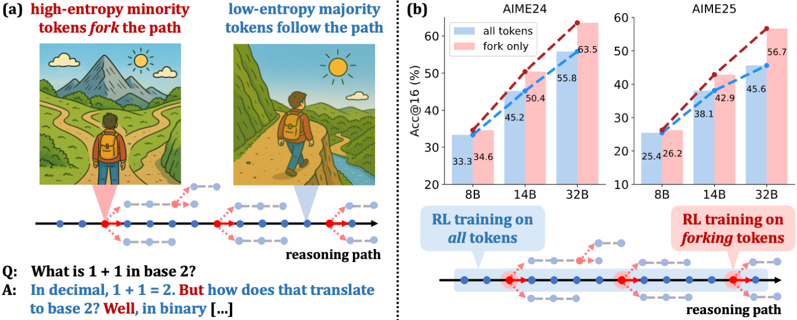
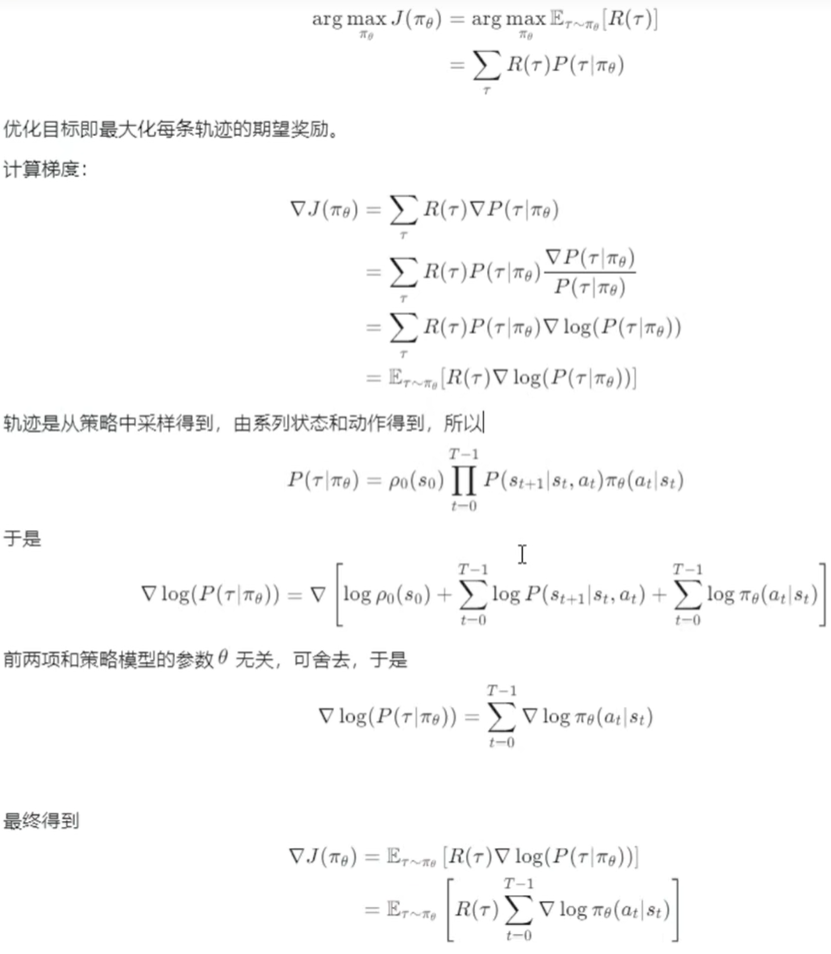
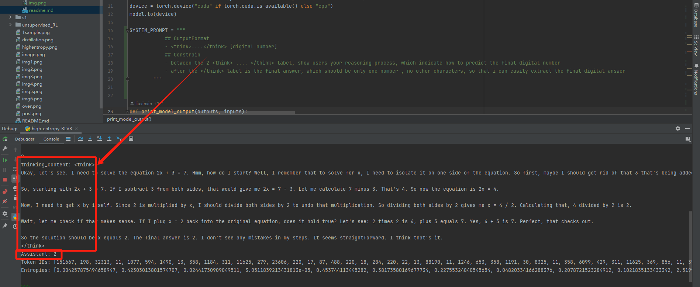

-论文复现：https://shenzhi-wang.github.io/high-entropy-minority-tokens-rlvr/?utm_source=chatgpt.com
Beyond the 80/20 Rule: High-Entropy Minority Tokens Drive Effective Reinforcement Learning for LLM Reasoning
-In CoTs, only a minority of tokens exhibit high entropy and act as "forks" in reasoning paths, while majority tokens are low-entropy. (b) RLVR using policy gradients of forking tokens delivers significant performance gains that scale with model size. With a 20k maximum response length, our 32B model sets new SoTA scores (63.5 on AIME'24 and 56.7 on AIME'25) for RLVR on base models under 600B. Extending the maximum response length to 29k further boosts the AIME'24 score to 68.1.

-policy model 基础（REINFORCE）
&ensp;&ensp;策略梯度算法通过对动作概率的对数取梯度，结合 reward 来更新模型参数：
&ensp;&ensp;&ensp;&ensp;&ensp;&ensp;∇ 𝜃 𝐽(𝜃)= 𝐸[∑ 𝑡 ∇ 𝜃 ln ⁡ 𝜋 𝜃(𝑎 𝑡 ∣ 𝑠 𝑡)⋅ 𝑅 𝑡]
&ensp;&ensp;这里可以理解为，“***如果某token带来高 reward，就提升它的概率: 比如这里提升aha moment相关token的概率***”
-为什么只更新高熵 token 更好？论文从理论和实证两个角度分析：
&ensp;&ensp;**高熵 token 是推理“分叉点”：它决定往哪个推理路径走，是关键决策点，更新它会带来更大预期收益(提高aha moment相关token的概率)**；低熵 token 多属于固定的“修饰”或“填充”，更新它对结果贡献小
&ensp;&ensp;梯度源自协变：在 policy gradient 更新中，模型 logits 与动作 reward 的协方差驱动熵变化。正协方差意味着模型趋向确认令这些 token 更确定，降低熵，即“entropy collapse”
。因此推荐只更新高熵 token，用以控制“重要决策点”的探索，同时避免整体熵迅速下降。
高熵 token 驱动表现提升：论文实验发现，仅更新 top 20% 高熵 token，在大模型（如 Qwen3-14B/32B）上，性能等同或优于更新全部 tokens；而仅更新低熵 token 会削弱性能

-这里扩展一下：某个trajectory的reward最大，逐步的公式推导如下：

𝑅(𝑡)是整个trajectory的reward，但pai_seta(at|st)是某个token单步，用完成trajectory的reward评价单个step的value，并不合理，因为整个trajectory高，不代表单个step就一定很好，所以要对𝑅(𝑡)做处理，不同的𝑅(𝑡)实现方式如下：

简单理解这个公式的意义：St状态下产生了at，这个at好不好了？肯定要乘以at的reward嘛！这个at的reward怎么算了？就有上述6种方式了！

high entropy RLVR就是第7种方式了！
-Qwen3的指令遵从能力还是很不错的：一次性就能让response按照我要求的format回答

