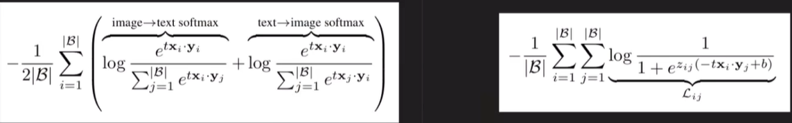

multimodel:siglip和clip相比的优势：  
1、loss函数对比如下：  
  
* SigLIP 采用了 Sigmoid 损失函数，与 CLIP 使用的 Softmax 对比损失不同。Sigmoid 损失仅对图像-文本对进行独立操作，无需像 Softmax 那样计算全局视图下的成对相似性并进行归一化。这种设计简化了训练过程，使得 SigLIP 在内存使用上更加高效。更高的内存效率意味着 SigLIP 可以支持更大的批次大小（batch size），或者在计算资源有限的设备上更轻松地进行训练。  

2、ImageNet 数据集上达到了 84.7% 的零-shot 准确率  
3、Sigmoid 损失函数将image-text对的匹配问题转化为二元分类任务，避免了 Softmax 在处理相似样本对时可能丢失细微差异的问题，提升model稳定性