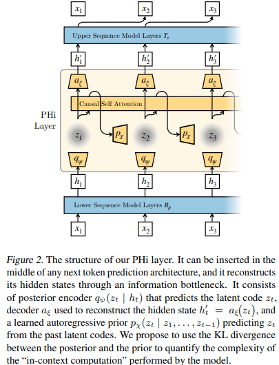
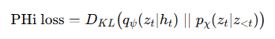

 LLM火热的这几年，以hinton、Illya为代表的大佬非常看好其前景，觉得LLM搞出的AI已经有潜意识，人类甚至需要开始注意防范。但也有Yan LeeCun、李飞飞等一众大佬表示LLM本质就是个统计模型，**只会根据上文预测next token的概率分布，这种原理的模型只会死记硬背训练预料提供的数据，就是个复读机，毫无泛化能力**，不值一提！所以现在顶尖大佬对LLM的能力和前景分歧很大，LLM在回答问题的时候究竟有没有思考？是不是直接背训练预料中的数据来回答？

2025.3月份，有来自瑞士 IDSIA 与斯坦福等机构的研究者提出了一种衡量LLM是否有思考能力的思路：*Measuring In-Context Computation Complexity via Hidden State Prediction* ，详见：  https://arxiv.org/pdf/2503.13431

论文的核心思路：要想探究LLM在回答问题时究竟有没有思考，最重要的是分析每个token的hidden state！

* 如果只是个复读机，仅仅是**简单粗暴地重复抄袭训练预料的数据，*并没有增加新的信息***，那么当前token的hidden state很容易通过上文所有token的hidden state预测出来！比如“3*7=”这个问题，乘法口诀表**有现成的答案，直接背诵就行了，很容易从上文归纳得到结果**，所以直接从上文就能得到next token的hidden state！
* **如果LLM真的在做复杂的思考，*不是简单粗暴地从训练语料中抄答案，肯定会额外带来新的信息，这些信息是训练语料中没有的，所以从上文的hidden state是不容易得到的***！比如各种复杂的数学猜想、复杂的逻辑推理，训练语料中完全没有现成的答案，没得抄；换句话说，直接根据上文的hidden state是很难确定next token的hidden state的！

    思路既然定了，接下来就要确定能落地实施的方案了！从上面的思路得知，需要上文每个token的hidden state信息。PHi设计的结构是这样的：

    

    hidden state经过矩阵后被转成**隐向量z，这里做了信息压缩**！然后再经过矩阵还原成hidden' state，这个PHi layer的矩阵loss如下：

   

* 如果 PHi loss高：说明**从上文所有token的z是无法直接得到当前token hidden state的，说明当前LLM正在引入新信息，也就是正在努力思考了**！

    代码来自：https://github.com/vincentherrmann/predicting-hidden-states/tree/master

    参考：https://mp.weixin.qq.com/s/jnmbgcI9wVXazqUhi-V8lQ
