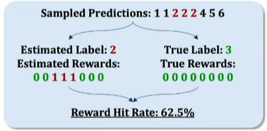
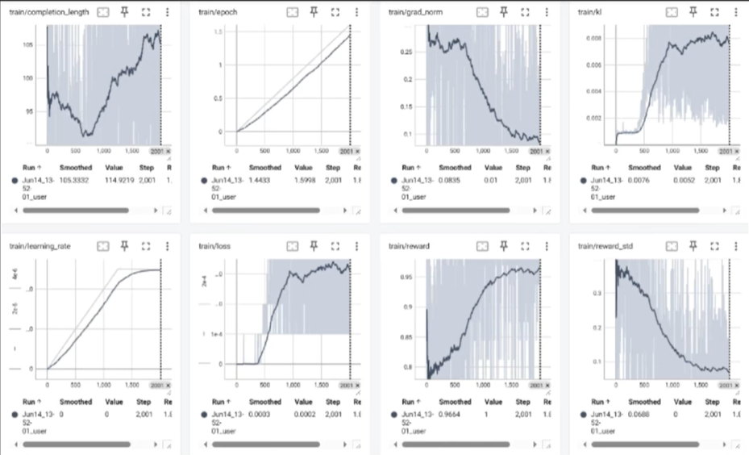
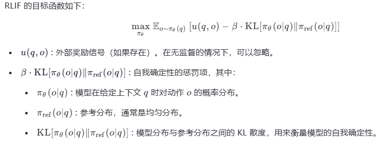
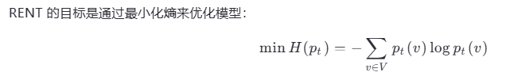

传统的RL都需要有明确的reward信号，这些都是需要人标注的，成本不低；一旦人为标注数据，RL其实和supervised learning没本质区别了；用RL做post-train的时候，能不能也像unsupervised learning那样不使用人工标注的数据来节约成本了（训练数据没有标注ground truth的情况该怎么办了？）？  

1、TTRL: Test-Time Reinforcement Learning: 详见 https://www.cnblogs.com/theseventhson/p/18850484
   简单理解：这种方式不需要人工标注答案，训练的时候怎么确定model的答案是对的了？这里就用majority voting了！
   如下图所示：假设LLM的回答是1、1、2、2、2、4、5、6，现在分两种情况：  
  &ensp;&ensp;&ensp;&ensp;&ensp;&ensp;

- 如果有true label = 3，那么所有的response都是错的，那么所有的reward都是0，整个gradient都是0；
- 如果没有true label，那就只能用majority voting啦，其中2最多，那么等于2的reward就是1，其他的是0
- 因为true label=3，response=2的reward就错了，这么来计算，reward hit rate，也就是reward本身的准确率=5/8=62.5%！  

&ensp;&ensp;&ensp;发现端倪了么？ **如果只用SFT，一旦majority voting出错，整个训练数据完全就是错的了！但如果使用RL的方式，即使positive reward是错的，但negative reward还是对的啊**！所以使用RL，即使majority voting错了，但negative信号是对的，相比SFT，有一定的容错性！  
&ensp;&ensp;&ensp;TTRL result：  

2、RLIF：Reinforcement Learning with Intrinsic Feedback  
&ensp;&ensp;&ensp;核心思想是利用模型的自我确定性 作为奖励信号。具体来说，模型在预测下一个词时，如果对自己的预测非常自信（即预测的概率分布非常尖锐），那么认为模型表现良好；反之，如果模型对自己的预测不自信（即预测的概率分布比较平坦），则认为模型表现较差。这种自我确定性可以通过模型输出的概率分布与均匀分布之间的KL散度来衡量：  
&ensp;&ensp;&ensp;&ensp;&ensp;&ensp;&ensp;&ensp;&ensp;&ensp;&ensp;  

3、RENT：Reward from ENtropy Training   
&ensp;&ensp;&ensp;RENT 的核心思想是使用熵作为奖励信号。熵是用来衡量随机变量不确定性的一个指标;熵越小，表示概率分布越集中，模型越确定；熵越大，表示概率分布越分散，模型越不确定。因此，通过最小化熵，可以提高模型输出的确信度。  
&ensp;&ensp;&ensp;&ensp;&ensp;&ensp;&ensp;&ensp;&ensp;&ensp;&ensp;      

&ensp;&ensp;&ensp;不管是采用投票、置信度还是熵，**随着训练的进行，会出现塌缩的现象，模型基本丧失探索能力，导致效果下降**。但是在合理的steps内，效果是会有一定提升的。

